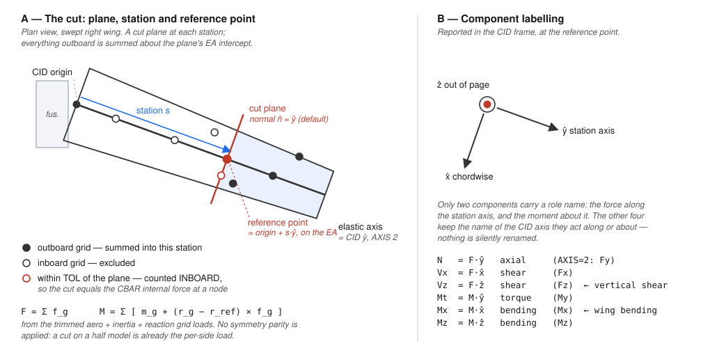

# sbeam — BDF Card Reference

All BDF cards supported in Phases 1–2 (structures), Phases A–C (aeroelastics, including splining and trim), and Phase G0 (transient maneuver loads). For each card: field layout, variable names and types, defaults, and a minimal example.

---

## File Structure

A sbeam run file (`.bdf`) has three sections:

```
$ comments begin with $
SOL 101               ← case control section (no header line)
SUBCASE 1
  ...
BEGIN BULK            ← marks start of bulk data section
  ...
ENDDATA               ← marks end of file
```

A bulk-only file (`.dat`) contains only the bulk data cards (no case control, no `BEGIN BULK` / `ENDDATA`).

---

## Format Rules

| Feature | Syntax |
|---------|--------|
| Free-field | Comma-separated fields: `GRID, 1, , 0.0, 0.0, 0.0` |
| Fixed-field | Standard NASTRAN 8-column fields (no commas) |
| Continuation | Next line starts with `+` (or blank first field in fixed format) |
| Comment | `$` anywhere on a line — rest of line is ignored |
| Blank field | Leave empty between commas or use double comma: `GRID, 1, , 0.0` |

Both free-field and fixed-field formats are supported. Continuation lines must immediately follow their parent card. Large-field (16-character, `NAME*`) format is **not** supported.

**Real number fields.** A NASTRAN data field is **8 characters wide**, in free field as well as
fixed field — a strict reader truncates each comma-delimited field to its first 8 characters.
sbeam's own reader does not enforce that width on input. Implicit-exponent reals (`1.44+9`,
`-2.31-4`, `1.5+03`) are accepted on read alongside ordinary Python float literals;
`parser/bdf_field.parse_real` is the single read-side implementation and
`parser/bdf_field.fmt_real8` the matching write side.

On the write side `fmt_real8` is used by the **load-card exports** (`FORCE`/`MOMENT` from
`results/load_export.py`; see `05c_sol144_maneuver.md` for the precision bound it implies), the
**authored-card writers** (`model/card_writers.py`), and the **aero-correction card export**
(`W2GJ`/`AECORR`/`STRIPK` from `aero/section_correction.py` / `aero/body_correction.py`, which
delegates to `card_writers.write_card` — DEF-M12, fixed 2026-08-02).

---

## Case Control Keywords

Case control appears between the `SOL` line and `BEGIN BULK`. Keywords are not order-sensitive except that `SUBCASE` groups the lines that follow it.

| Keyword | Type | Description |
|---------|------|-------------|
| `SOL` | int | Solution type. `101` = static, `103` = normal modes, `144` = static aeroelastic trim |
| `TITLE` | str | Analysis title — echoed to `.f06` output |
| `SUBCASE` | int | Opens a subcase block; all lines until the next `SUBCASE` belong to it |
| `LOAD` | int | Load set ID (references `FORCE`/`MOMENT`/`LOAD` bulk cards) |
| `SPC` | int | Constraint set ID (references `SPC`/`SPC1` bulk cards) |
| `METHOD` | int | Eigenvalue method SID (references `EIGRL` bulk card; SOL 103 only) |
| `TRIM` | int | Trim condition SID (references `TRIM` bulk card; SOL 144 only) |
| `TRIMOBJ` | int | Trim objective SID (references `TRIMOBJ` bulk card; over-determined SOL 144 trim) |
| `DIVERG` | int | Divergence condition SID (references `DIVERG` bulk card; SOL 144 only) |
| `MLOADS` | int | Transient maneuver-loads SID (references `MLOADS` bulk card; runs the Step 63 free-flight modal solver `solver/maneuver_modal.py` when the card's NMODES/METHOD/ZETA select it, else the prescribed-rigid direct solver `solver/maneuver_qs.py`; SOL 144, Phase G0) |
| `MASSSET` | int | Payload / mass case SID (references `MASSSET` bulk card, Step 60); the subcase runs at the resolved mass configuration — baseline when absent |
| `DISPLACEMENT` | — | Request nodal displacement output (`= ALL` or `= PRINT`) |
| `SPCFORCE` | — | Request SPC reaction force output |
| `OLOAD` | — | Request applied load echo output |
| `FORCE` | — | Request CBAR/CBUSH element force output |
| `STRESS` | — | Request CBAR stress output at recovery points |
| `AEROF` | — | Request per-box aerodynamic force output (SOL 144; emits the AERODYNAMIC BOX PRESSURES AND FORCES block) |
| `APRES` | — | Request per-box aerodynamic pressure (ΔCp) output (SOL 144; same output block as `AEROF`) |
| `INCLUDE` | str | Path to a bulk data file: `INCLUDE 'model.dat'`. May appear **several times** — the bulk is the concatenation of every included file, in order, followed by any inline bulk after `BEGIN BULK`. Used to layer an overlay over a shared bulk (`sample/cessna210_flagship_body.bdf`) |

**Example case control section:**

```
SOL 101
$
SUBCASE 1
  TITLE = Cantilever tip load
  SPC   = 1
  LOAD  = 10
  DISPLACEMENT = ALL
  SPCFORCE     = ALL
  FORCE        = ALL
  STRESS       = ALL
$
BEGIN BULK
```

---

## Bulk Data Cards

### CORD2R — Rectangular Coordinate System

Defines a right-handed Cartesian coordinate system by three points in a reference system.

**Format:**
```
CORD2R, CID, RID, A1, A2, A3, B1, B2, B3
+,      C1,  C2,  C3
```

The continuation line is **required**.

**Fields:**

| Field | Variable | Type | Description | Default |
|-------|----------|------|-------------|---------|
| CID | `cid` | int | Coordinate system ID (> 0, unique) | required |
| RID | `rid` | int | Reference CID (`0` = global) | `0` |
| A1–A3 | `a` | float×3 | Origin of new system in RID frame | required |
| B1–B3 | `b` | float×3 | Point on local +Z axis in RID frame | required |
| C1–C3 | `c` | float×3 | Point in local XZ-plane in RID frame | required |

Local axes are derived: `z = B − A`, `x_temp = C − A`, `y = z × x_temp`, `x = y × z`.

Points A, B, C must be non-collinear: coincident A/B raises
`ValueError("points A and B are coincident")` and collinear A, B, C raises
`ValueError("points A, B, C are collinear")` when the transform is resolved at the
end of parsing.

**Example:**
```
$ CID=1, reference=global, Z-axis along global Z, X-axis along global Y
CORD2R, 1, 0, 0.0, 0.0, 0.0, 0.0, 0.0, 1.0
+,      1.0, 0.0, 0.0
```

---

### GRID — Grid Point (Node)

Defines a node in the model.

**Format:**
```
GRID, GID, CP, X1, X2, X3, CD, PS, SEID
```

**Fields:**

| Field | Variable | Type | Description | Default |
|-------|----------|------|-------------|---------|
| GID | `gid` | int | Grid ID (unique) | required |
| CP | `cp` | int | Input coordinate system for X1–X3 (`0` = global) | `0` |
| X1 | `x` | float | X coordinate in CP frame | required |
| X2 | `y` | float | Y coordinate in CP frame | required |
| X3 | `z` | float | Z coordinate in CP frame | required |
| CD | `cd` | int | Output coordinate system for displacement results (`0` = global) | `0` |
| PS | `ps` | str | Permanent SPC DOF string (e.g., `"123456"`) | `""` |
| SEID | — | — | Superelement ID — must be blank | — |

Coordinates are transformed to global CID 0 during parsing; CP and CD are stored for output.

**Example:**
```
$ GID=1 at origin, global input and output frame
GRID, 1, , 0.0, 0.0, 0.0
$ GID=6 at x=10, CD=1 (results in user coordinate system 1)
GRID, 6, , 10.0, 0.0, 0.0, 1
```

---

### MAT1 — Isotropic Material

Defines a linear elastic isotropic material.

**Format:**
```
MAT1, MID, E, G, NU, RHO
```

**Fields:**

| Field | Variable | Type | Description | Default |
|-------|----------|------|-------------|---------|
| MID | `mid` | int | Material ID (unique) | required |
| E | `E` | float | Young's modulus | required |
| G | `G` | float | Shear modulus | `0.0` |
| NU | `nu` | float | Poisson's ratio | `0.0` |
| RHO | `rho` | float | Mass density | `0.0` |

If both G and NU are non-zero, G takes precedence. When G is blank or zero (and both
E and NU are non-zero), G is derived from the isotropic relationship
`G = E / (2·(1 + ν))` at parse time. RHO is required for SOL 103 unless CONM2 supplies all mass.

**Example:**
```
$ Steel: E=200 GPa, G=76.9 GPa, nu=0.3, rho=7850 kg/m³
MAT1, 1, 2.0e11, 7.692e10, 0.3, 7850.0
```

---

### PBAR — Beam Cross-Section Property

Defines uniform cross-section properties for CBAR elements.

**Format:**
```
PBAR, PID, MID, A, I1, I2, J, NSM
+,    C1, C2, D1, D2, E1, E2, F1, F2
```

The continuation line is optional (stress recovery points default to 0).

**Fields:**

| Field | Variable | Type | Description | Default |
|-------|----------|------|-------------|---------|
| PID | `pid` | int | Property ID (unique) | required |
| MID | `mid` | int | Material ID (references MAT1) | required |
| A | `A` | float | Cross-sectional area | required |
| I1 | `I1` | float | Moment of inertia about element y-axis (bending in XZ plane) | required |
| I2 | `I2` | float | Moment of inertia about element z-axis (bending in XY plane) | required |
| J | `J` | float | Torsional constant | required |
| NSM | `nsm` | float | Non-structural mass per unit length | `0.0` |
| C1, C2 | `c1`, `c2` | float | y, z of stress recovery point C | `0.0` |
| D1, D2 | `d1`, `d2` | float | y, z of stress recovery point D | `0.0` |
| E1, E2 | `e1`, `e2` | float | y, z of stress recovery point E | `0.0` |
| F1, F2 | `f1`, `f2` | float | y, z of stress recovery point F | `0.0` |

**Example:**
```
$ Solid square cross-section: side=0.316 m → A=0.1, I=8.333e-4, J=1.406e-3
PBAR, 1, 1, 0.1, 8.333e-4, 8.333e-4, 1.406e-3
$ Stress recovery at corners (y=±0.158, z=±0.158)
+,    0.15811, 0.15811, -0.15811, 0.15811, -0.15811, -0.15811, 0.15811, -0.15811
```

---

### PBUSH — Spring-Damper Property

Defines stiffness (and optionally damping) for CBUSH elements.

**Format:**
```
PBUSH, PID, K, K1, K2, K3, K4, K5, K6
```

The literal keyword `K` identifies the stiffness group.

**Fields:**

| Field | Variable | Type | Description | Default |
|-------|----------|------|-------------|---------|
| PID | `pid` | int | Property ID (unique) | required |
| `K` | — | str | Literal keyword `K` (stiffness group identifier) | required |
| K1 | `k1` | float | Stiffness for DOF 1 (Tx) | `0.0` |
| K2 | `k2` | float | Stiffness for DOF 2 (Ty) | `0.0` |
| K3 | `k3` | float | Stiffness for DOF 3 (Tz) | `0.0` |
| K4 | `k4` | float | Stiffness for DOF 4 (Rx — torsion) | `0.0` |
| K5 | `k5` | float | Stiffness for DOF 5 (Ry) | `0.0` |
| K6 | `k6` | float | Stiffness for DOF 6 (Rz) | `0.0` |

Only the `K` keyword is supported in Phase 1–2. The `B` (damping) keyword raises `ValueError`.

**Example:**
```
$ Grounded translational spring, 5000 N/m in X only
PBUSH, 10, K, 5000.0
$ Full 6-DOF spring
PBUSH, 20, K, 1.0e6, 1.0e6, 1.0e6, 1.0e3, 1.0e3, 1.0e3
```

---

### CBAR — Beam Element (Euler-Bernoulli)

Defines a two-node beam element with uniform cross-section.

**Format:**
```
CBAR, EID, PID, GA, GB, X1, X2, X3, OFFT
+,    PA, PB
```

The continuation line is optional.

**Fields:**

| Field | Variable | Type | Description | Default |
|-------|----------|------|-------------|---------|
| EID | `eid` | int | Element ID (unique) | required |
| PID | `pid` | int | Property ID (references PBAR) | required |
| GA | `ga` | int | End A grid ID | required |
| GB | `gb` | int | End B grid ID | required |
| X1 | `x1` | float | Orientation vector component 1 | required |
| X2 | `x2` | float | Orientation vector component 2 | required |
| X3 | `x3` | float | Orientation vector component 3 | required |
| OFFT | `offt` | str | Offset flag | `"GGG"` |
| PA | `pa` | str | Pin releases at end A (DOF digits 1–6) | `""` |
| PB | `pb` | str | Pin releases at end B (DOF digits 1–6) | `""` |

The orientation vector `[X1, X2, X3]` defines the element y-axis and must not be parallel to the element axis (GA→GB). Only the vector form is supported — the NASTRAN
G0 (grid-ID) form of the orientation field is **not** supported; an integer in field 5
is read as a vector component, not a grid reference.

Pin-release DOF digits (PA/PB) are in **element local axes** (1 = axial, 4 = torsion,
5/6 = local bending rotations), not the global DOFs of the DOF Reference table.
Releases zero the corresponding rows/columns of the local 12×12 stiffness before
transformation to global.

**Example:**
```
$ Beam along X-axis, orientation vector in +Y (element y = global Y)
CBAR, 1, 1, 1, 2, 0.0, 1.0, 0.0
$ Pin release: Ry and Rz released at both ends (moment-free = truss)
CBAR, 5, 1, 5, 6, 0.0, 1.0, 0.0
+,    56, 56
```

---

### CBUSH — Spring-Damper Element

Defines a two-node (or grounded one-node) spring-damper element.

**Format:**
```
CBUSH, EID, PID, GA, GB, S, CID
+,     X1, X2, X3
```

Both the inline fields after CID and the continuation line are optional.

**Fields:**

| Field | Variable | Type | Description | Default |
|-------|----------|------|-------------|---------|
| EID | `eid` | int | Element ID (unique) | required |
| PID | `pid` | int | Property ID (references PBUSH) | required |
| GA | `ga` | int | Node A grid ID | required |
| GB | `gb` | int or None | Node B grid ID; blank/omitted = grounded at GA | `None` |
| S | — | — | Spring location ratio — read and ignored | — |
| CID | — | int | Orientation CID — must be `0` or blank | `0` |
| X1–X3 | `x1`–`x3` | float | Orientation vector (continuation) | `0.0` |

For a grounded element (GB blank), stiffness acts only on GA DOFs. For a two-node element, symmetric stiffness couples GA and GB.

CBUSH is **massless** — it contributes stiffness only. To model mass at a spring
connection point, add a CONM2 at the grid.

The orientation vector X1–X3 (CBAR convention: defines the element XZ plane) is
**required** when GA and GB are coincident — a coincident two-node CBUSH without it
raises `ValueError`. For a grounded element the orientation vector defines the local
x-axis.

**Example:**
```
$ Two-node spring between grids 1 and 2
CBUSH, 1, 10, 1, 2
$ Grounded spring at grid 3 (no GB)
CBUSH, 2, 10, 3
```

---

### PLOTEL — Plot-Only Element

Defines a line segment for visualisation only. Not included in structural matrices.

**Format:**
```
PLOTEL, EID, G1, G2
```

**Fields:**

| Field | Variable | Type | Description | Default |
|-------|----------|------|-------------|---------|
| EID | `eid` | int | Element ID (unique) | required |
| G1 | `g1` | int | Grid point 1 | required |
| G2 | `g2` | int | Grid point 2 | required |

**Example:**
```
$ Visualisation line from node 5 to node 7 (e.g. sensor arm)
PLOTEL, 10, 5, 7
```

---

### RBE2 — Rigid Body Element (Rigid Constraint)

Rigidly couples selected DOFs of dependent grids to an independent grid.

**Format:**
```
RBE2, EID, GN, CM, GM1, GM2, GM3, GM4, GM5, GM6
+,    GM7, GM8, ...
```

Additional dependent grids may span continuation lines.

**Fields:**

| Field | Variable | Type | Description | Default |
|-------|----------|------|-------------|---------|
| EID | `eid` | int | Element ID (unique) | required |
| GN | `gn` | int | Independent grid ID | required |
| CM | `cm` | str | DOF string coupling GN to all GMs (e.g., `"123456"`) | required |
| GM1–GMn | `gm` | list[int] | Dependent grid IDs | required |

**Constraint enforced** (full rigid-body kinematics, including the lever-arm effect of
any offset between GN and GM): for each dependent grid GM with offset
`d = (dx, dy, dz) = r_GM − r_GN` in global coordinates,

```
u_GM = R @ u_GN,   R = [ 1  0  0    0   dz  -dy ]
                       [ 0  1  0  -dz    0   dx ]
                       [ 0  0  1   dy  -dx    0 ]
                       [ 0  0  0    1    0    0 ]
                       [ 0  0  0    0    1    0 ]
                       [ 0  0  0    0    0    1 ]
```

Only the rows of `R` for the DOFs listed in CM are applied
(`u_GM[d] = R[d, :] @ u_GN`). When the offset is zero, `R` reduces to identity and
the constraint becomes the direct DOF copy `u_GM[d] = u_GN[d]`. GN must not itself be
a dependent DOF of another constraint element (raises `ValueError`).

**Attaching mass via RBE2 + CONM2:** place the CONM2 on the **independent (GN)**
node; its mass is carried into the reduced system through `M_red = Tᵀ M T`. Placing a
CONM2 on a dependent GM node is mathematically valid (the transformation
redistributes it) but is untested — prefer the GN attachment.

**Example:**
```
$ GID 3 rigidly follows GID 2 in all 6 DOFs
RBE2, 1, 2, 123456, 3
$ Multiple dependents: GIDs 3, 4, 5 all follow GID 1
RBE2, 2, 1, 123456, 3, 4, 5
$ 100 t engine mass at GID 7, carried through an RBE2 from GID 6
RBE2, 20, 7, 123456, 6
CONM2, 30, 7, 0, 100000.0
```

---

### RBAR — Rigid Bar Element

Defines a rigid bar between two grids. All 6 DOFs at GB depend on GA via rigid body kinematics (includes lever-arm effect from the offset vector).

**Format:**
```
RBAR, EID, GA, GB, CNA, CNB, CMA, CMB
```

**Fields:**

| Field | Variable | Type | Description | Default |
|-------|----------|------|-------------|---------|
| EID | `eid` | int | Element ID (unique) | required |
| GA | `ga` | int | End A grid (independent) | required |
| GB | `gb` | int | End B grid (dependent) | required |
| CNA | `cna` | str | Independent DOF components at GA | `"123456"` |
| CNB | `cnb` | str | Independent DOF components at GB | `""` (blank) |
| CMA | — | — | Dependent DOF components at GA (auto-computed; stored in BDF, not in dataclass) | blank |
| CMB | — | — | Dependent DOF components at GB (auto-computed; stored in BDF, not in dataclass) | blank |

**Phase 1 constraint:** CNA=`"123456"`, CNB=blank only. Non-default combinations raise `ValueError`.

**Constraint equations:**

```
u_Bx = u_Ax +  dz·θ_Ay - dy·θ_Az
u_By = u_Ay - dz·θ_Ax  + dx·θ_Az
u_Bz = u_Az + dy·θ_Ax  - dx·θ_Ay
θ_Bx = θ_Ax
θ_By = θ_Ay
θ_Bz = θ_Az
```

where `d = (dx, dy, dz) = r_GB − r_GA` in global coordinates.

**Example:**
```
$ GB=3 rigidly follows GA=2 with full rigid body kinematics (grids may be offset)
RBAR, 1, 2, 3
$ Same, with explicit default fields
RBAR, 1, 2, 3, 123456, , ,
```

---

### RBE3 — Rigid Body Element (Interpolation Constraint)

Constrains a dependent (reference) grid to the weighted average motion of independent grids.

**Format:**
```
RBE3, EID, (blank), REFGRID, REFC, WT1, C1, G1_1, G1_2, ...
+,    WT2, C2, G2_1, G2_2, ...
```

Each weight group `(WTi, Ci, Gi_1, Gi_2, ...)` may span continuation lines.

**Fields:**

| Field | Variable | Type | Description | Default |
|-------|----------|------|-------------|---------|
| EID | `eid` | int | Element ID (unique) | required |
| (blank) | — | — | Field 2 must be blank | — |
| REFGRID | `refgrid` | int | Dependent reference grid ID | required |
| REFC | `refc` | str | DOF string for the dependent grid | required |
| WTi | (in `wt_gc`) | float | Weight for independent grid group i | required |
| Ci | (in `wt_gc`) | str | DOF string for group i | required |
| Gi_j | (in `wt_gc`) | list[int] | Independent grid IDs for group i | required |

`wt_gc` is a list of `(weight: float, dofs: str, grids: list[int])` tuples.

Constraint: `u_REFGRID[d] = Σᵢ(wᵢ × u_i[d]) / Σᵢ wᵢ` for each DOF `d` in REFC.

**Limitation — same-DOF averaging only:** each dependent DOF is a weighted average of
the *same-numbered* DOF at the independent grids; rotation-to-translation coupling
across an offset (lever-arm kinematics) is **not** applied. This simplified
formulation is exact when the independent grids are collocated with the reference
point or the independent set moves rigidly. When the offset lever-arm effect matters,
use RBAR (kinematically exact rigid connection) instead.

**Example:**
```
$ REFGRID=7 follows the average motion of GID 6, equal weight, all 6 DOFs
RBE3, 20, , 7, 123456, 1.0, 123456, 6
$ Two groups with different weights
RBE3, 30, , 10, 123, 2.0, 123, 1, 2, 1.0, 123, 3
```

---

### CONM2 — Concentrated Mass Element

Adds a point mass (with optional CG offset and inertia tensor) at a grid point.

**Format:**
```
CONM2, EID, GID, CID, M, X1, X2, X3
+,     I11, I21, I22, I31, I32, I33
```

The continuation line is optional (all inertia terms default to 0).

**Fields:**

| Field | Variable | Type | Description | Default |
|-------|----------|------|-------------|---------|
| EID | `eid` | int | Element ID (unique) | required |
| GID | `gid` | int | Grid point where mass is attached | required |
| CID | `cid` | int | Coordinate system for offset vector and inertia tensor | `0` |
| M | `m` | float | Mass value | `0.0` |
| X1 | `x1` | float | Offset from grid to CG, component 1 in CID | `0.0` |
| X2 | `x2` | float | Offset from grid to CG, component 2 in CID | `0.0` |
| X3 | `x3` | float | Offset from grid to CG, component 3 in CID | `0.0` |
| I11 | `i11` | float | Moment of inertia about CID axis 1 at CG | `0.0` |
| I21 | `i21` | float | Product of inertia, axes 2–1 | `0.0` |
| I22 | `i22` | float | Moment of inertia about CID axis 2 at CG | `0.0` |
| I31 | `i31` | float | Product of inertia, axes 3–1 | `0.0` |
| I32 | `i32` | float | Product of inertia, axes 3–2 | `0.0` |
| I33 | `i33` | float | Moment of inertia about CID axis 3 at CG | `0.0` |

**Assembly:** each CONM2 contributes a full symmetric 6×6 block at its grid:

- translational: `m · I₃`
- translation–rotation coupling (offset `r` non-zero): `−m · skew(r)` and its transpose
- rotational: `I_cm + m · (|r|² · I₃ − r·rᵀ)` (parallel-axis transfer of the CG inertia
  tensor to the grid)

When CID ≠ 0, the offset and inertia tensor are rotated to global before assembly:
`r = R @ r_cid`, `I = R @ I_cid @ Rᵀ`.

> **⚠ Sign convention differs from MSC NASTRAN:** sbeam uses the off-diagonal fields as
> the **direct (positive) tensor entries** —
> `I_cid = [[I11, I21, I31], [I21, I22, I32], [I31, I32, I33]]`
> (`assembly/mass_matrix.py:130-134`, gated by `tests/aero/test_trim_urdd.py:265-279`).
> MSC NASTRAN's CONM2 fields are the **negated** products of inertia. A NASTRAN deck
> with nonzero I21/I31/I32 therefore imports into sbeam with flipped inertia coupling —
> negate those three fields when porting. See `09_conventions.md` §9.

> **Singular mass warning (SOL 103):** a CONM2 with zero offset and zero inertia on a
> model with `rho = 0.0` MAT1s populates only the three translational DOFs at its grid
> — the global mass matrix is singular. `solve_modes` applies Tikhonov regularisation
> to zero-mass DOFs; see `docs/10_standard/04_modal_analysis.md`.

**Examples:**
```
$ 100 kg point mass at GID 7, no offset, no inertia
CONM2, 30, 7, 0, 100.0
$ 0.001 kg mass with torsional inertia I11=2.0 kg·m² (inline continuation)
CONM2, 1, 2, 0, 0.001, 0.0, 0.0, 0.0, 2.0
$ Mass with full inertia tensor on continuation line
CONM2, 2, 5, 0, 50.0, 0.1, 0.0, 0.0
+,     1.5, 0.0, 2.0, 0.0, 0.0, 3.0
```

---

### MASSSET — Payload / Mass Case (Step 60)

Defines a named mass configuration built from the baseline model mass. Selected per
subcase with the case-control request `MASSSET = sid` (SOL 144 static trim, balanced
maneuvers, and the Phase G0 transient maneuver solver).

**Format:**
```
MASSSET, SID, LABEL, SCALE
+,       ADD,     e1, e2, ...
+,       REPLACE, old1, new1, old2, new2, ...
+,       DELETE,  e1, e2, ...
```

Continuation rows are an op keyword followed by CONM2 EIDs (up to 7 per fixed-field
row). Any number of rows of any op may appear, in any order.

**Fields:**

| Field | Variable | Type | Description | Default |
|-------|----------|------|-------------|---------|
| SID | `sid` | int | Mass-case ID (referenced in case control) | required |
| LABEL | `label` | str | Case name used in output headers | `MASSSET <sid>` |
| SCALE | `scale` | float | Multiplies the **baseline** mass (must be ≥ 0) | `1.0` |

**Ops:**

| Op | Arguments | Effect |
|----|-----------|--------|
| `ADD` | overlay CONM2 EIDs | layers the named CONM2s on top of the baseline |
| `REPLACE` | `(baseline EID, overlay EID)` **pairs** | drops the baseline card and puts the overlay card in its place — each row must hold an even number of EIDs |
| `DELETE` | baseline CONM2 EIDs | removes the named baseline CONM2s from the case |

**The baseline / overlay rule.** Overlay CONM2s are ordinary `CONM2` bulk cards. Every
EID named by an `ADD` or by the *overlay* (second) slot of a `REPLACE` pair is marked
**overlay-only** and is excluded from the baseline mass — it enters only the cases that
name it. Every EID named by a `DELETE` or by the *baseline* (first) slot of a `REPLACE`
pair is a **baseline** EID. An EID must be one or the other; using it as both is an error.
A CONM2 named by no MASSSET at all is an ordinary baseline mass present in every case.

**SCALE** applies to the whole baseline mass — CBAR distributed mass (`rho·A + nsm`) and
baseline CONM2 mass and inertia alike — and is applied *before* the ops. Overlay cards
enter at their card values, unscaled: SCALE is a baseline factor, the overlay is the
payload the deck states explicitly.

**What is rebuilt per case:** only mass-derived quantities — `M_gg`, the inertial
sensitivity `M_ax`, GPWG mass/CG, and the trim solve. Stiffness, splines, the VLM AIC
and the whole `AeroCache` are geometry/Mach-only and are **shared untouched** across a
mass sweep.

**Errors:** an EID not defined by any CONM2 card (`ADD`/`REPLACE`/`DELETE`); an EID
referenced more than once within one MASSSET; an EID used as both overlay and baseline;
an odd EID count on a `REPLACE` row; an unknown op keyword; a negative `SCALE`; a
duplicate MASSSET SID; a case-control `MASSSET` selecting an undefined SID.

**Not supported (v1):** MAT1 `rho` overlays (structural-density cases) — use `SCALE`,
or author a separate deck.

**Example** (from `sample/ha144a_massset_sweep.bdf`):
```
$ Baseline includes the 500 lb baggage CONM2 5000; 6001-6004, 6011-6014
$ and 6020 are overlay-only and enter only where named.
MASSSET, 10, EMPTY, 1.0
+, DELETE, 5000
MASSSET, 20, HALFFUEL, 1.0
+, ADD, 6001, 6002, 6003, 6004
MASSSET, 30, FULLFUEL, 1.0
+, ADD, 6011, 6012, 6013, 6014
+, REPLACE, 5000, 6020
```

**Not mirrored:** `mirror_halfspan` rejects a deck containing MASSSET cards — whether a
payload item mirrors (wing fuel) or does not (a centreline store) is model intent, not
geometry.

---

### SPC — Single-Point Constraint (Grid Pairs)

Applies zero (or enforced) displacement to individual grid DOFs.

**Format:**
```
SPC, SID, G1, C1, D1, G2, C2, D2
```

**Fields:**

| Field | Variable | Type | Description | Default |
|-------|----------|------|-------------|---------|
| SID | `sid` | int | Constraint set ID (referenced in case control) | required |
| G1 | `g1` | int | Grid ID 1 | required |
| C1 | `c1` | str | DOF string for G1 (e.g., `"13"`, `"123456"`) | required |
| D1 | `d1` | float | Enforced displacement for G1 — must be `0.0` in Phase 1 | `0.0` |
| G2 | `g2` | int or None | Grid ID 2 (optional) | `None` |
| C2 | `c2` | str or None | DOF string for G2 | `None` |
| D2 | `d2` | float | Enforced displacement for G2 | `0.0` |

DOF digits: `1`=Tx, `2`=Ty, `3`=Tz, `4`=Rx, `5`=Ry, `6`=Rz. Multiple SPC cards with the same SID are merged.

**Example:**
```
$ Fix Tx and Tz at GID 1; fix Ty at GID 2
SPC, 1, 1, 13, 0.0, 2, 2, 0.0
```

---

### SPC1 — Single-Point Constraint (Grid List)

Applies zero displacement to the same DOFs across multiple grids.

**Format:**
```
SPC1, SID, C, G1, G2, G3, G4, G5, G6
+,    G7, G8, ...
```

Grid IDs may span continuation lines.

**Fields:**

| Field | Variable | Type | Description | Default |
|-------|----------|------|-------------|---------|
| SID | `sid` | int | Constraint set ID | required |
| C | `c` | str | DOF string applied to all grids | required |
| G1–Gn | `grids` | list[int] | Grid IDs to constrain | required |

**Example:**
```
$ Fix all 6 DOFs at GID 1 (encastre)
SPC1, 1, 123456, 1
$ Pin support: fix translations at GIDs 1 and 10
SPC1, 2, 123, 1, 10
```

---

### FORCE — Concentrated Force

Applies a force vector at a grid point.

**Format:**
```
FORCE, SID, GID, CID, F, N1, N2, N3
```

**Fields:**

| Field | Variable | Type | Description | Default |
|-------|----------|------|-------------|---------|
| SID | `sid` | int | Load set ID | required |
| GID | `gid` | int | Grid point | required |
| CID | `cid` | int | Coordinate system for N1–N3 (`0` = global) | `0` |
| F | `f` | float | Scale factor (force magnitude if N is a unit vector) | `0.0` |
| N1 | `n1` | float | Force direction component 1 | `0.0` |
| N2 | `n2` | float | Force direction component 2 | `0.0` |
| N3 | `n3` | float | Force direction component 3 | `0.0` |

Applied force vector = `F × [N1, N2, N3]`. Multiple FORCE cards with the same SID are summed.

**Example:**
```
$ 1000 N in –Z at GID 6, global frame
FORCE, 10, 6, 0, 1000.0, 0.0, 0.0, -1.0
$ 500 N in +X at GID 3, user coordinate system 2
FORCE, 10, 3, 2, 500.0, 1.0, 0.0, 0.0
```

---

### MOMENT — Concentrated Moment

Applies a moment vector at a grid point. Identical format to FORCE.

**Format:**
```
MOMENT, SID, GID, CID, M, N1, N2, N3
```

**Fields:**

| Field | Variable | Type | Description | Default |
|-------|----------|------|-------------|---------|
| SID | `sid` | int | Load set ID | required |
| GID | `gid` | int | Grid point | required |
| CID | `cid` | int | Coordinate system for N1–N3 (`0` = global) | `0` |
| M | `m` | float | Scale factor (moment magnitude if N is a unit vector) | `0.0` |
| N1 | `n1` | float | Moment axis component 1 | `0.0` |
| N2 | `n2` | float | Moment axis component 2 | `0.0` |
| N3 | `n3` | float | Moment axis component 3 | `0.0` |

Applied moment vector = `M × [N1, N2, N3]`.

**Example:**
```
$ 200 N·m about +Z at GID 6
MOMENT, 10, 6, 0, 200.0, 0.0, 0.0, 1.0
```

---

### LOAD — Load Superposition

Defines a combined load as a linear combination of FORCE/MOMENT load sets.

**Format:**
```
LOAD, SID, S, S1, L1, S2, L2, S3, L3, ...
```

**Fields:**

| Field | Variable | Type | Description | Default |
|-------|----------|------|-------------|---------|
| SID | `sid` | int | Combined load set ID (referenced in case control) | required |
| S | `s` | float | Overall scale factor | required |
| S1, S2, … | (in `components`) | float | Scale factor for component load i | required |
| L1, L2, … | (in `components`) | int | Load set ID for component load i (references FORCE, MOMENT, or GRAV SID) | required |

`components` is a list of `(scale: float, load_sid: int)` pairs. Applied load = `S × Σᵢ(Sᵢ × Loadᵢ)`.

**Example:**
```
$ Combine load sets 10 and 20 with factors 1.0 and 2.0, overall scale 1.0
LOAD, 100, 1.0, 1.0, 10, 2.0, 20
```

---

### GRAV — Gravity Body Load

Applies a uniform body acceleration to all mass-bearing DOFs using the assembled consistent mass matrix.

**Format:**
```
GRAV, SID, CID, G, N1, N2, N3
```

**Fields:**

| Field | Variable | Type | Description | Default |
|-------|----------|------|-------------|---------|
| SID | `sid` | int | Load set ID (referenced by `LOAD` card or directly by `LOAD` in case control) | required |
| CID | `cid` | int | Coordinate system for direction vector (`0` = global only in Phase 1–2) | `0` |
| G | `g` | float | Acceleration magnitude (m/s² or consistent units) | required |
| N1 | `n1` | float | Direction component 1 | required |
| N2 | `n2` | float | Direction component 2 | required |
| N3 | `n3` | float | Direction component 3 | required |

The gravity load vector is computed as `f_grav = M_global × a_field`, where `a_field` has `G × [N1, N2, N3]` at every translational DOF and zero at rotational DOFs. Both CBAR distributed mass and CONM2 point masses contribute naturally through the assembled consistent mass matrix.

GRAV SIDs may appear as component loads in a `LOAD` card, mixed freely with `FORCE` and `MOMENT` SIDs. CID ≠ 0 raises a parse error in Phase 1–2.

> **Reaction recovery:** SPC reactions are computed as
> `R = K[spc, :] @ u − f_applied[spc]`. The `f_applied[spc]` term subtracts the
> gravity (and other applied) load acting directly at SPC'd DOFs, so reactions do not
> undercount the supported weight. See `docs/10_standard/03_static_analysis.md`.

**Example:**
```
$ Standard gravity in –Y (g = 9.81 m/s²), global frame
GRAV, 1, 0, 9.81, 0.0, -1.0, 0.0
$ Reference GRAV via LOAD card (combined with a point force)
LOAD, 100, 1.0, 1.0, 1, 1.0, 10
```

---

### EIGRL — Real Eigenvalue Extraction (Lanczos)

Defines parameters for normal modes extraction (SOL 103).

**Format:**
```
EIGRL, SID, V1, V2, ND, MSGLVL, MAXSET, SHFSCL, NORM
```

**Fields:**

| Field | Variable | Type | Description | Default |
|-------|----------|------|-------------|---------|
| SID | `sid` | int | Set ID (referenced by `METHOD` in case control) | required |
| V1 | `v1` | float or None | Lower frequency bound (Hz); blank = no lower limit | `None` |
| V2 | `v2` | float or None | Upper frequency bound (Hz); blank = no upper limit | `None` |
| ND | `nd` | int or None | Number of modes to extract; blank = all in [V1,V2] | `None` |
| MSGLVL | — | — | Message level — ignored | — |
| MAXSET | — | — | Maximum Lanczos set size — ignored | — |
| SHFSCL | — | — | Shift scale — ignored | — |
| NORM | `norm` | str | Mode shape normalisation: `"MASS"` or `"MAX"` | `"MASS"` |

At least one of ND or V2 must be specified to bound the extraction.

**Examples:**
```
$ Extract 10 modes, MASS normalisation, no frequency filter
EIGRL, 20, , , 10, , , , MASS
$ Extract all modes between 1 Hz and 100 Hz, MAX normalisation
EIGRL, 30, 1.0, 100.0, , , , , MAX
```

---

## Phase A — Aerodynamics

### AEROS — Aerodynamic Reference Geometry

Defines the reference quantities used to non-dimensionalise lift, drag, and moment
coefficients, and the symmetry condition for the VLM.

**Format:**
```
AEROS  ACSID  RCSID  CREF  BREF  SREF  SYMXZ  SYMXY  [MACH]
```

**Fields:**

| Field | Variable | Type | Description | Default |
|-------|----------|------|-------------|---------|
| ACSID | `acsid` | int | Aerodynamic coordinate system (Phase A: must be 0) | `0` |
| RCSID | `rcsid` | int | Reference coordinate system for rigid-body motion (Phase A: must be 0) | `0` |
| CREF | `cref` | float | Reference chord (consistent model units) | required |
| BREF | `bref` | float | Reference span — full span | required |
| SREF | `sref` | float | Reference area — full area | required |
| SYMXZ | `symxz` | int | Parsed for NASTRAN compatibility; **must be 0** — `build_aero_model` rejects non-zero (half-span) | `0` |
| SYMXY | `symxy` | int | Parsed for NASTRAN compatibility; **must be 0** — `build_aero_model` rejects non-zero (half-span) | `0` |
| MACH | `mach` | float | **sbeam extension** — freestream Mach number for Prandtl–Glauert / Göthert compressibility correction (§2.8 of theory doc). Omit or set to 0.0 for incompressible. Capped at 0.99; must be subsonic. | `0.0` |

> **Note:** The MACH field (field 8) is an sbeam extension. The NASTRAN AEROS card has no MACH field; in MSC Nastran, Mach appears on the TRIM card (Phase C).

> **Full-span only:** sbeam does not support half-span / symmetry models. `SYMXZ`/`SYMXY` are
> parsed so legacy decks load, but `build_aero_model` raises `ValueError` for any non-zero
> value. Unfold a legacy half-span deck with `sbeam.aero.mirror.mirror_halfspan()`.

One AEROS card per model. A second card raises `ValueError("Duplicate AEROS card")`.
CAERO1 cards without an AEROS card raise `ValueError("CAERO1 card(s) present but no AEROS card found")`.

**Examples:**
```
$ Full-span wing: chord=2.0, span=10.0, area=20.0 — incompressible
AEROS, 0, 0, 2.0, 10.0, 20.0, 0, 0
$ Same wing at M=0.6 (Prandtl–Glauert correction active)
AEROS, 0, 0, 2.0, 10.0, 20.0, 0, 0, 0.6
```

---

### PAERO1 — Aerodynamic Panel Properties (Phase A stub)

Referenced by CAERO1. Phase A carries no body elements; the card is a placeholder.

**Format:**
```
PAERO1  PID
```

**Fields:**

| Field | Variable | Type | Description | Default |
|-------|----------|------|-------------|---------|
| PID | `pid` | int | Property ID (unique; referenced by CAERO1) | required |

**Example:**
```
PAERO1, 1
```

---

### PSTRIP — Decoupled Strip Body-Panel Property (sbeam extension)

Alternative to PAERO1 for the CAERO1 PID. A CAERO1 whose PID references a `PSTRIP`
is a **decoupled strip body panel**: it carries NO horseshoe vortex, NO wake, and NO
aerodynamic coupling to or from any other box (its block of the influence operator is
diagonal). Each box is an independent 2-D section, `ΔCp_box = slope·(α·n_z + β·n_y + Δα)`.
Because it has no coupling, a strip body panel **cannot contaminate the lifting
surfaces** — and it carries no interference/fence effect either. Used as a fuselage
load stand-in tuned to total-aircraft targets (`build_strip_body_correction`); see
`docs/10_standard/05a_aero_vlm.md` and `sbeam/aero/strip.py`.

**Format:**
```
PSTRIP  PID  SLOPE0
```

**Fields:**

| Field | Variable | Type | Description | Default |
|-------|----------|------|-------------|---------|
| PID | `pid` | int | Property ID (unique across PAERO1+PSTRIP; referenced by CAERO1) | required |
| SLOPE0 | `slope0` | float | Nominal per-box lift-curve slope dΔCp/dα_local | π |

The default π gives a sectional lift-curve slope of π — half the 2π flat-plate value
("50% normal surface"). Override per box with a `STRIPK` card.

**Example:**
```
$ default slope (π)
PSTRIP, 20
$ explicit slope
PSTRIP, 21, 2.5
```

---

### AEFACT — Arbitrary Fraction List

Defines non-uniform spanwise or chordwise breakpoints for CAERO1 meshing.

**Format:**
```
AEFACT  SID  D1  D2  D3  D4  D5  D6  D7
+       D8   D9  ...
```

**Fields:**

| Field | Variable | Type | Description | Default |
|-------|----------|------|-------------|---------|
| SID | `sid` | int | Set ID (unique; referenced by CAERO1 LSPAN or LCHORD) | required |
| D1–DN | `data` | list[float] | Decimal fractions 0.0–1.0; must start at 0.0 and end at 1.0 | required |

Multiple continuation lines are supported. The list must have NSPAN+1 or NCHORD+1 values.

**Examples:**
```
$ Three equal strips (4 breakpoints including 0.0 and 1.0)
AEFACT, 10, 0.0, 0.333, 0.667, 1.0
$ Clustered leading-edge panels (8 chordwise breakpoints)
AEFACT, 20, 0.0, 0.05, 0.1, 0.2, 0.4, 0.6, 0.8, 1.0
```

---

### CAERO1 — Aerodynamic Panel Macroelement

Defines a flat trapezoidal lifting surface. Meshed into NSPAN×NCHORD boxes by
`mesh_caero1()` in `sbeam/aero/panel.py`.

**Format:**
```
CAERO1  EID  PID  CP  NSPAN  NCHORD  LSPAN  LCHORD  IGID
+       X1   Y1   Z1  X12    X4      Y4     Z4      X43
```

**Fields:**

| Field | Variable | Type | Description | Default |
|-------|----------|------|-------------|---------|
| EID | `eid` | int | Element ID (unique) | required |
| PID | `pid` | int | References PAERO1 | required |
| CP | `cp` | int | Coordinate system for P1/P4 (0 = global; or CORD2R CID) | `0` |
| NSPAN | `nspan` | int | Number of equal spanwise boxes (0 if LSPAN used) | `0` |
| NCHORD | `nchord` | int | Number of equal chordwise boxes (0 if LCHORD used) | `0` |
| LSPAN | `lspan` | int | AEFACT SID for non-uniform span breakpoints (0 if NSPAN used) | `0` |
| LCHORD | `lchord` | int | AEFACT SID for non-uniform chord breakpoints (0 if NCHORD used) | `0` |
| IGID | `igid` | int | Interference group ID (ignored in Phase A) | `0` |
| X1, Y1, Z1 | `p1` | float×3 | Root leading-edge point, in CP coordinate system | required |
| X12 | `x12` | float | Root chord length in freestream +X direction | required |
| X4, Y4, Z4 | `p4` | float×3 | Tip leading-edge point, in CP coordinate system | required |
| X43 | `x43` | float | Tip chord length in freestream +X direction | required |

The continuation line (P1/X12/P4/X43) is required. Exactly one of NSPAN/LSPAN must be
non-zero; exactly one of NCHORD/LCHORD must be non-zero.

Cross-reference validation (post-parse): PID not in `bulk.paero1s` → `ValueError`;
LSPAN/LCHORD not in `bulk.aefacts` → `ValueError`; CAERO1 present, no AEROS → `ValueError`.

Mesh-quality warnings (A7/A8, pre-solve in `build_aero_model`, VLM panels only): fewer
than 4 chordwise boxes, or any box aspect ratio (spanwise/streamwise edge) outside
[0.5, 2.0], emits a `UserWarning`. For chordwise refinement at low box counts use
LE-concentrated cosine breakpoints — `sbeam.aero.panel.cosine_chord_fractions(n)`
generates the AEFACT fraction list for `LCHORD`.

**Example:**
```
$ 4×10 wing: root LE at origin, tip LE at y=5, chord=2
CAERO1, 100, 1, 0, 4, 10, 0, 0, 0
+,      0.0, 0.0, 0.0, 2.0, 0.0, 5.0, 0.0, 2.0
```

---

### W2GJ — Baseline Incidence / Camber (initial downwash)

Per-box built-in incidence/camber angles (rad) representing geometry not captured by
the VLM angle of attack (wing incidence, twist, camber line, CFD/WT Δα corrections).
**NASTRAN sign convention** (MSC Aeroelastic UG Eq. 2-104; HA144A example): **positive
= leading-edge-up incidence → more lift**, the same nose-up-positive sense as ANGLEA.
`build_wg` negates card data into sbeam's internal washout-positive normalwash.
(Convention corrected 2026-07-05 — AE8a root cause.)

**Format:**
```
W2GJ  SID  CAERO_EID  D1  D2  D3  D4  D5  D6
+     D7   D8  ...
```

**Fields:**

| Field | Variable | Type | Description | Default |
|-------|----------|------|-------------|---------|
| SID | `sid` | int | Set ID | required |
| CAERO_EID | `caero_eid` | int | EID of the CAERO1 this incidence applies to | required |
| D1–DN | `data` | list[float] | Built-in incidence per box (rad), nose-up positive (NASTRAN convention), row-major order | required |

Row-major order: span index slowest, chord index fastest — matching `mesh_caero1()` box ordering.

**Example:**
```
$ Uniform +2° incidence (0.0349 rad, more lift) on a 4×2 panel (8 boxes);
$ a 2° WASHOUT twist would be -0.0349.
W2GJ, 5, 100, 0.0349, 0.0349, 0.0349, 0.0349, 0.0349, 0.0349
+,    0.0349, 0.0349
```

---

### WKK — Diagonal AIC Correction

Lowest-fidelity AIC correction: scales each row of the AIC matrix by a per-box
weight. The corrected AIC is `AJJ* = diag(w) @ AJJ`; the caller inverts it via
`np.linalg.lstsq`.

**Format:**
```
WKK  SID  CAERO_EID  W1  W2  W3  W4  W5  W6
+    W7   W8  ...
```

**Fields:**

| Field | Variable | Type | Description | Default |
|-------|----------|------|-------------|---------|
| SID | `sid` | int | Set ID | required |
| CAERO_EID | `caero_eid` | int | EID of the CAERO1 this correction applies to | required |
| W1–WN | `data` | list[float] | Diagonal weight per box, row-major order | required |

**Example:**
```
$ Uniform 10% uplift on a 4×2 panel (8 boxes)
WKK, 10, 100, 1.1, 1.1, 1.1, 1.1, 1.1, 1.1
+,   1.1, 1.1
```

---

### AECORR — Force/Pressure AIC Correction

Higher-fidelity AIC correction that matches VLM predictions to CFD or wind-tunnel
target data at a reference condition. One method:

- **WT2** (pressure matching): per-box `cp` targets.

A second method, **WT1** (force/moment matching, per-strip lift targets), was
**removed at the first SOL 144 loads release (DEF-R7)**; `METHOD=WT1` now raises a
`ValueError` at read time. It had been deprecated by DEF-H2/H3 (2026-07-31) for
delivering `f_target/β²` instead of `f_target` at Mach > 0 (56 % overshoot at
M = 0.6; exact at M = 0 only), and for rescaling strips on *every* surface sharing
an `i_span` index on multi-CAERO1 decks — a wing card corrupted the tail load while
the wing missed its own target. Use **WT2** or the section-correction path
(`sbeam/aero/section_correction.py`), which are correct and strictly more capable.

**Format:**
```
AECORR  SID  METHOD  CAERO_EID  T1  T2  T3  T4  T5
+       T6   T7  ...
```

**Fields:**

| Field | Variable | Type | Description | Default |
|-------|----------|------|-------------|---------|
| SID | `sid` | int | Set ID | required |
| METHOD | `method` | str | `'WT2'` — the only accepted value; `'WT1'` raises a `ValueError` naming its removal (DEF-R7), any other value raises `ValueError` | required |
| CAERO_EID | `caero_eid` | int | EID of the CAERO1 this correction applies to | required |
| T1–TN | `target` | list[float] | Target cp per box (row-major) | required |

Reference normalwash: `w_ref = -ones(n)` (uniform unit incidence, same as
`solve_rigid_cl` at `alpha=1`).

**Examples:**
```
$ WT2: pressure-matching targets for an 8-box panel
AECORR, 20, WT2, 100, 0.45, 0.30, 0.22, 0.18, 0.45, 0.30, 0.22, 0.18

```

**Correction precedence** in `build_aero_model()`: WKK → WT2 → identity lstsq.
Strip body panels (CAERO1 PID → PSTRIP) bypass this entirely — see `STRIPK`.

---

### CHORDCP — Injected Steady-Pressure Distribution (sbeam extension, Step 54)

Supplies the per-box **physical steady Cp** of one CAERO1 surface, measured (CFD or
wind tunnel) at a stated reference angle of attack. At assembly the injected pressures
**replace the program-computed mean flow** (the W2GJ-driven baseline) on all VLM
lifting surfaces via an equivalent-normalwash substitution, so a SOL 144 trim becomes
a perturbation about the measured operating point. See
`docs/10_standard/05a_aero_vlm.md` (usage) and
`docs/20_theory/01_aeroelastics_theory.md` (derivation).

**Format:**
```
CHORDCP  SID  CAERO_EID  ALPHREF  MACH
+        CP1  CP2  CP3  ...
```

**Fields:**

| Field | Variable | Type | Description | Default |
|-------|----------|------|-------------|---------|
| SID | `sid` | int | Set ID | required |
| CAERO_EID | `caero_eid` | int | EID of the CAERO1 the pressures apply to (must be a VLM surface, not PSTRIP) | required |
| ALPHREF | `alpha_ref` | float | Reference angle of attack the data was measured at, **degrees** (stored internally in radians) | **required** |
| MACH | `mach` | float | Mach the data was measured at; validation only (warned against the TRIM Mach) | blank = not stated |
| CP1–CPN | `data` | list[float] | Physical steady Cp per box, row-major (span slowest, chord fastest — same ordering as W2GJ) | required |

**Coverage rule (v1):** when any CHORDCP card is present, **every** VLM CAERO1 must
carry exactly one, and all cards must state the same ALPHREF. PSTRIP strip body panels
are excluded (they keep their W2GJ/Δα wash) and may not be targeted. The W2GJ baseline
on injected surfaces is discarded (warned) — the injected Cp must already contain the
camber/incidence content.

**Example:**
```
$ Wing pressures from CFD at alpha = 2.0 deg, Mach 0.9 (8 boxes)
CHORDCP, 40, 100, 2.0, 0.9, 0.52, 0.31, 0.21, 0.14
+,       0.52, 0.31, 0.21, 0.14
```

---

### STRIPK — Per-Box Strip Lift-Curve Slopes (sbeam extension)

Overrides the uniform `PSTRIP` `slope0` box-by-box for a decoupled strip body panel.
Emitted by `build_strip_body_correction` (with a `W2GJ` Δα-offset card) so the total
airplane Cm/Cn/Cl match CFD/WT. Applies only to a strip (PSTRIP-backed) CAERO1.

**Format:**
```
STRIPK  SID  CAERO_EID  S1  S2  S3  S4  S5  S6
+       S7   S8  ...
```

**Fields:**

| Field | Variable | Type | Description | Default |
|-------|----------|------|-------------|---------|
| SID | `sid` | int | Set ID | required |
| CAERO_EID | `caero_eid` | int | EID of the strip CAERO1 this applies to | required |
| S1–SN | `data` | list[float] | Per-box lift-curve slope dΔCp/dα_local (row-major, signed), length NSPAN×NCHORD | required |

Absent → every box of the panel uses the `PSTRIP` `slope0`. The operator's strip
diagonal is `-slope/β` (Göthert 1/β applied for compressibility).

**Example:**
```
STRIPK, 9501, 400, 3.05, 3.05, 2.98, 2.98, 3.10, 3.10, 3.02, 3.02
```

---

## Splining Cards (Phase B)

The spline cards couple aero boxes to structural grids (`g_slope` / `g_disp` operators).
See `docs/10_standard/05b_splining.md` for the interpolation theory and the
rigid-body exactness gates. Every box must be covered by exactly one spline card;
overlapping coverage raises `ValueError`, uncovered boxes emit a `UserWarning`.

NASTRAN box ID convention (row-major, matching `mesh_caero1()`):
`box_id = CAERO1.EID + i_span × n_chord_boxes + j_chord`.

**CAERO1 EID spacing is a hard constraint.** A CAERO1 therefore occupies the
`NSPAN × NCHORD` consecutive box IDs starting at its EID, so **each CAERO1 must be
numbered at least `NSPAN × NCHORD` above the previous one**. Overlapping ranges make
`SPLINE2`/`ATTACH`/`SPLINE0` box ranges, `AELIST` control-surface boxes and `MONPNT1`
integration resolve to the wrong box — `build_aero_model` raises naming both CAERO1s
and the required renumbering (defect F1). The shipped sample decks use `EID = 1000 × k`
in declaration order, which is the recommended convention.

---

### SET1 — Structural Grid List

Lists the structural grid IDs a SPLINE2 interpolates from (referenced by SETG). Also
referenced by `SET1`-type AECOMP cards for MONPNT3 grid collections.

**Format:**
```
SET1, SID, G1, G2, G3, ...
+,    G8, G9, ...
```

Grid IDs may span continuation lines.

**Fields:**

| Field | Variable | Type | Description | Default |
|-------|----------|------|-------------|---------|
| SID | `sid` | int | Set ID (unique; referenced by SPLINE2 SETG or AECOMP) | required |
| G1–Gn | `grids` | list[int] | Structural grid IDs | required |

Cross-reference validation (post-parse): every grid ID must exist in GRID, else
`ValueError`. A SET1 referenced by a SPLINE2 needs at least 2 grids (spline build).

**Example:**
```
$ Wing elastic-axis grids for the beam spline
SET1, 1100, 10, 11, 12, 13, 14, 15
```

---

### SPLINE2 — Beam Spline (NASTRAN infinite beam spline)

Couples a range of aero boxes to structural grids via the MSC infinite-beam-spline
formulation (MSC Aeroelastic Analysis UG Eqs. 2-48…2-63): bending + torsion point-load
kernels along the spline axis with **rigid chord arms**, so off-axis grids are legal and
carry twist information through their deflections. Rewritten at the AC7 close-out
(2026-07-05); the former cubic-Hermite implementation and its EA-collinearity restriction
are gone.

**Format:**
```
SPLINE2, EID, CAERO, ID1, ID2, SETG, DZ, DTOR, CID
+,       DTHX, DTHY, , USAGE
```

The continuation line is optional (DTHX/DTHY default 0.0 = rigid attachment).

**Fields:**

| Field | Variable | Type | Description | Default |
|-------|----------|------|-------------|---------|
| EID | `eid` | int | Element ID (unique) | required |
| CAERO | `caero` | int | CAERO1 EID of the panel being splined | required |
| ID1 | `id1` | int | First NASTRAN box ID in the range | required |
| ID2 | `id2` | int | Last NASTRAN box ID in the range | required |
| SETG | `setg` | int | SET1 SID listing the structural grids | required |
| DZ | `dz` | float | Linear (deflection) attachment flexibility: `0.0` = rigid, > 0 = spring; negative warns and is treated as rigid | `0.0` |
| DTOR | `dtor` | float | Torsional flexibility ratio **EI/GJ** (used; only the ratio matters); ≤ 0 warns and falls back to 1.0 | `1.0` |
| CID | `cid` | int | CORD2R CID; the **y-axis** is the spline axis, the x-axis the chord/rigid-arm direction, the z-axis the deflection direction (MSC convention) | `0` |
| DTHX | `dthx` | float | Bending-slope (rotation about CID x) attachment flexibility: `0.0` = rigid, > 0 = spring, negative = not attached | `0.0` |
| DTHY | `dthy` | float | Torsion (rotation about CID y = spline axis) attachment flexibility, same convention | `0.0` |
| USAGE | `usage` | str | `FORCE` / `DISP` / `BOTH` (informational; not filtered in Phase B) | `"BOTH"` |

Note the blank field before USAGE on the continuation line (field 4).

Cross-reference validation (post-parse): SETG not in SET1 → `ValueError`;
CAERO not in CAERO1 → `ValueError`. A singular spline system (e.g. an EA-only collinear
SET1 with DTHY < 0 — no twist information) raises a `ValueError` at operator build.

**Example (HA144A wing — MSC card values):**
```
$ Wing boxes 1100-1131 to SET1 1100 (root grids + LE/TE stringers); axis = CORD2R 2 y-axis
SPLINE2, 1601, 1100, 1100, 1131, 1100, 0.0, 1.0, 2
+,       -1.0, -1.0
```

---

### ATTACH — Rigid Attachment (sbeam extension)

Rigidly couples a group of aero boxes to a single master structural grid. All boxes
in the covered range move as a rigid body with the master grid (lever-arm kinematics
about the box ¼-chord force point). ZAERO-inspired sbeam extension.

**Format:**
```
ATTACH, EID, CAERO, ID1, ID2, GRID, CID
```

**Fields:**

| Field | Variable | Type | Description | Default |
|-------|----------|------|-------------|---------|
| EID | `eid` | int | Element ID (unique) | required |
| CAERO | `caero` | int | CAERO1 EID of the panel | required |
| ID1 | `id1` | int | First NASTRAN box ID in the range | required |
| ID2 | `id2` | int | Last NASTRAN box ID in the range | required |
| GRID | `grid` | int | Master structural grid ID | required |
| CID | `cid` | int | Coordinate system — must be `0`; CID ≠ 0 raises `NotImplementedError` at spline build | `0` |

**Example:**
```
$ Rigidly attach fuselage boxes 2001-2016 to grid 50
ATTACH, 300, 2001, 2001, 2016, 50
```

**Sign convention:** a nose-up (+Ry) rotation of the master grid produces nose-up
incidence `+n_z` on the covered boxes; roll (+Rx) produces none. See
[`05b_splining.md`](05b_splining.md) for the full kinematics (DEF-H1, 2026-07-31).

---

### SPLINE0 — Zero-Displacement Constraint (sbeam extension)

Registers a box range as "covered" without adding any structural coupling: the
`g_slope` / `g_disp` rows of the covered boxes remain zero, so the boxes neither
deflect with the structure nor take downwash from it. Used for panels whose own
elasticity is negligible — typically the body panels of the cruciform (A9) and
decoupled-strip (A10) workflows.

Their aerodynamic **load is not discarded**: since Step 64 it is injected into the
structure as a rigid load (net force plus the moment of the box forces) at the
master grid named in field 5, through the `g_load` force-transfer operator. That
load enters the SOL 144 trim force balance, the `FORCE`/`MOMENT` export, MONPNT3
and the maneuver solvers. Leave the field blank to use the SUPORT grid.

**Format:**
```
SPLINE0, EID, CAERO, ID1, ID2, GRID
```

**Fields:**

| Field | Variable | Type | Description | Default |
|-------|----------|------|-------------|---------|
| EID | `eid` | int | Element ID (unique) | required |
| CAERO | `caero` | int | CAERO1 EID of the panel | required |
| ID1 | `id1` | int | First NASTRAN box ID in the range | required |
| ID2 | `id2` | int | Last NASTRAN box ID in the range | required |
| GRID | `grid` | int | Master structural grid carrying the injected load (basic CID 0) | blank = SUPORT grid |

Pick a `GRID` that physically carries the panel — a fuselage grid under the body
panel, not an arbitrary reference — since the injected force and moment load the
structure there. The f06 `INJECTED AERO LOADS` block echoes each panel's master
grid and its 6-component resultant so a misplaced choice is visible.

**Warnings / errors:**

- `ValueError` if `GRID` is given but is not a grid of the structural model.
- `UserWarning` when neither `GRID` nor a SUPORT grid is available (SOL 101 decks):
  the panel's force stays out of the structural load path, as before Step 64.
- `UserWarning` naming the grid used when the model has several SUPORT grids.

**Example:**
```
$ Boxes 3001-3008 carry aero load but do not deflect structurally;
$ their resultant is applied at fuselage GRID 98
SPLINE0, 400, 3001, 3001, 3008, 98
```

---

### SPLINE1 — Infinite-Plate Spline (parsed but rejected)

The Harder–Desmarais infinite-plate spline (IPS) is **not implemented** (Step 48
deferred). The keyword is recognised by the dispatch table, but the handler raises
`NotImplementedError` immediately — any SPLINE1 card in a deck aborts parsing with:

```
SPLINE1 (Harder–Desmarais infinite-plate spline) is not yet implemented;
use SPLINE2 or ATTACH instead
```

The `Spline1` dataclass (EID, CAERO, ID1, ID2, SETG, DZ, CID) exists in
`sbeam/model/aero.py` as a placeholder for the future implementation.

---

## Trim Card Set (SOL 144)

The following cards define the static aeroelastic trim problem. They are parsed and
cross-referenced by the BDF reader but are not yet consumed by a solver (solver deferred
to Step 52+).

---

### AESTAT — Rigid-body aerodynamic extra point

Defines a rigid-body trim DOF label. Each AESTAT card declares one label that can be
prescribed or solved in a TRIM condition.

**Standard labels:**

| Label | Meaning |
|-------|---------|
| `ANGLEA` | Angle of attack α |
| `SIDES` | Sideslip angle β |
| `ROLL` | Roll rate p |
| `PITCH` | Pitch rate q |
| `YAW` | Yaw rate r |
| `URDD2` | Lateral acceleration ÿ |
| `URDD3` | Normal acceleration z̈ |
| `URDD4` | Roll angular acceleration |
| `URDD5` | Pitch angular acceleration |
| `URDD6` | Yaw angular acceleration |

**Format:**
```
AESTAT  ID  LABEL
```

| Field | Type | Description |
|-------|------|-------------|
| ID | int | Unique identifier |
| LABEL | str | Trim DOF label (see table above) |

**Example:**
```
AESTAT, 100, ANGLEA
AESTAT, 101, PITCH
```

---

### AESURF — Aerodynamic control surface

Defines a control surface by name, hinge-line coordinate system, and the AELIST of aero
boxes that deflect with the surface.

**Format:**
```
AESURF  ID  LABEL  CID1  ALID1  CID2  ALID2  EFF
```

| Field | Type | Default | Description |
|-------|------|---------|-------------|
| ID | int | — | Unique identifier |
| LABEL | str | — | Control surface name (e.g. `AILERON`) |
| CID1 | int | — | Coordinate system defining the hinge axis — the **y-axis** of this CORD2R is the hinge line (`integration.build_djx` takes `R[:, 1]`), matching the SPLINE2 spline-axis convention |
| ALID1 | int | — | AELIST SID listing boxes on this surface |
| CID2 | int | 0 | Optional second hinge CID (0 = unused) |
| ALID2 | int | 0 | Optional second AELIST SID (0 = unused) |
| EFF | float | 1.0 | Control-surface effectiveness factor |

**Example:**
```
AESURF, 200, AILERON, 10, 50
```

**Cross-reference:** ALID1 (and ALID2 if non-zero) must exist in AELIST.

---

### AELIST — Aerodynamic box ID list

Lists the CAERO1 box IDs that form a control surface or other group.

**Format:**
```
AELIST  SID  E1  E2  E3  ...
+       E9  E10  ...
```

| Field | Type | Description |
|-------|------|-------------|
| SID | int | Set identifier |
| E1, E2, … | int | CAERO1 box IDs (continuation lines allowed) |

**Example:**
```
AELIST, 50, 1001, 1002, 1003, 1004
```

**Validation:** Every box ID must fall within the range `[CAERO1.EID, CAERO1.EID + NSPAN×NCHORD − 1]` of at least one CAERO1.

---

### TRIM — Static trim condition

Specifies the Mach number, dynamic pressure, and prescribed values for a subset of trim
variables. All remaining variables (AESTAT + AESURF labels not listed here) are free DOFs
for the trim solver.

**Format:**
```
TRIM  SID  MACH  Q  L1  UX1  L2  UX2  L3  UX3
+     L4   UX4   ...
```

| Field | Type | Description |
|-------|------|-------------|
| SID | int | Unique identifier (referenced by case control `TRIM=`) |
| MACH | float | Mach number |
| Q | float | Dynamic pressure |
| L1, UX1, … | str, float | Label/value pairs for prescribed variables (continuation OK) |
| `RHOREF`, ρ | str, float | **sbeam extension** (Step 61): reserved pseudo-label carrying the freestream density for this flight condition. Not a trim variable — it never enters the trim solve. Its only use is `V = √(2·Q/ρ)`, the true airspeed the transient maneuver rate terms need (`build_dj_rigidrate`). Omit it and `Trim.velocity()` raises. |

**Example:**
```
TRIM, 10, 0.3, 1500.0, PITCH, 0.0, URDD3, -1.0
$ with the density needed by transient maneuver runs (V = sqrt(2*1500/0.002377))
TRIM, 11, 0.3, 1500.0, RHOREF, 2.377-3, PITCH, 0.0
+,    URDD3, -1.0
```

**Validation:**
- Every label must be defined by an AESTAT or AESURF card.
- Duplicate labels within one TRIM card raise `ValueError`.
- `RHOREF` must be positive; an AESTAT/AESURF label named `RHOREF` is rejected
  (it would collide with the reserved pseudo-label).
- DOF-count diagnostic: warns if all labels are prescribed (nothing to solve) or if the
  system is over-determined and no TRIMOBJ card is present.

---

### DIVERG — Divergence speed analysis

Specifies the number of divergence roots to find and the Mach values at which to
evaluate the divergence eigenvalue problem (Step 55). For each Mach the solver returns
the lowest `NROOTS` positive divergence dynamic pressures `q_div`, their mode shapes, and
— when `RHOREF` is given — the divergence speeds `V_div = √(2·q_div/ρ)`.

**Format:**
```
DIVERG  SID  NROOTS  RHOREF  M1  M2  ...
+       M7   M8      ...
```

| Field | Type | Description |
|-------|------|-------------|
| SID | int | Unique identifier (referenced by case control `DIVERG=`) |
| NROOTS | int | Number of divergence roots to find |
| RHOREF | float | **sbeam extension** (field 4): reference density used to map `q_div → V_div`. Leave blank/`0.0` to omit `V_div`. |
| M1, M2, … | float | Mach values (field 5 onward; continuation lines allowed). When omitted the AEROS Mach is used as a single point. |

**Example:**
```
DIVERG, 20, 2, 1.225, 0.4, 0.6, 0.8
```

> **Note** — `RHOREF` occupies field 4; the Mach list begins in field 5. A DIVERG
> subcase does not require a TRIM card: divergence depends only on `K_aa` and `Q_aa`,
> not on the trim right-hand side.

---

### SUPORT — Free-Body Support DOFs

Declares the rigid-body reference (r-set) DOFs for a free-flight trim: the a-set is
partitioned into l-set / r-set at these DOFs and the trim solver holds `u_r = 0`
(mean-axis constraint). Also used by MONPNT3 reaction recovery and the Phase G0
restrained-l-set integration.

**Format:**
```
SUPORT, G1, C1, G2, C2, ...
```

**Fields:**

| Field | Variable | Type | Description | Default |
|-------|----------|------|-------------|---------|
| G1, G2, … | `gid` | int | Grid ID of a support point | required |
| C1, C2, … | `dofs` | str | DOF string for the preceding grid (e.g. `"35"`, `"123456"`) | required |

GID/DOF pairs repeat across the card; parsing stops at the first blank GID field. A
blank DOF string after a GID raises `ValueError`. Each pair is appended to
`bulk.supports` — multiple SUPORT cards accumulate.

**Example:**
```
$ Support plunge and pitch at the reference grid 1
SUPORT, 1, 35
```

---

### TRIMVAR — Per-variable bounds (sbeam-defined, over-determined trim)

When a trim problem has more free variables than equilibrium equations, TRIMVAR defines
bounds and an initial guess for each variable so that the over-determined system can be
solved as a constrained least-squares problem (minimising the TRIMOBJ objective).

**Format:**
```
TRIMVAR  ID  LABEL  INIT  LB  UB
```

| Field | Type | Default | Description |
|-------|------|---------|-------------|
| ID | int | — | Unique identifier |
| LABEL | str | — | AESTAT or AESURF label this bound applies to |
| INIT | float | 0.0 | Initial guess |
| LB | float | −1×10³⁰ | Lower bound |
| UB | float | +1×10³⁰ | Upper bound |

**Example:**
```
TRIMVAR, 10, ANGLEA, 0.05, -0.3, 0.3
TRIMVAR, 11, AILERON, 0.0, -0.5, 0.5
```

---

### TRIMOBJ — Weighted objective function (sbeam-defined, over-determined trim)

Defines the weighted least-squares objective for the over-determined trim solve.
Label/weight pairs are summed: `J = Σ wᵢ·(xᵢ − x̄ᵢ)²`.

**Format:**
```
TRIMOBJ  SID  L1  W1  L2  W2  L3  W3  L4  W4
+        L5   W5  ...
```

| Field | Type | Description |
|-------|------|-------------|
| SID | int | Unique identifier |
| L1, W1, … | str, float | Label/weight pairs (continuation lines allowed) |

**Example:**
```
TRIMOBJ, 20, ANGLEA, 1.0, CL, 0.5
+        CM, 0.1
```

---

### TRIMCON — Inequality constraint (sbeam-defined, over-determined trim)

Adds a scalar inequality constraint to the over-determined trim optimisation.
Multiple TRIMCON cards may share the same SID; they are collected as a list.

**Format:**
```
TRIMCON  SID  LABEL  SENSE  RHS
```

| Field | Type | Description |
|-------|------|-------------|
| SID | int | Constraint group identifier |
| LABEL | str | Variable label to constrain |
| SENSE | str | `LE` (≤) or `GE` (≥) |
| RHS | float | Right-hand side of the inequality |

**Example:**
```
TRIMCON, 30, CL, GE, 0.3
TRIMCON, 31, CM, LE, 0.02
```

---

### GUSTLF — Quasi-static gust load case (sbeam extension)

Applies a precomputed FAR/CS 23.341 gust load factor to a referenced `TRIM`, and
records the derivation that produced it. Selected by case control `GUSTLF = sid`.

**Only `TRIMID`, `N` and `G` affect the solution** — the card prescribes
`URDD3 = −N·G` on the referenced TRIM. Every other field is *provenance*: echoed to
the f06 and never entering an equation.

That split is deliberate. The gust calculation is dimensional (`U_de` is 50 ft/s,
the schedule is keyed to altitude in feet) while sbeam's card fields are unit-neutral
by charter (`09_conventions.md` §7) and the solver has no atmosphere model. The
dimensional half therefore lives in **`sbeam_tools/cases/gust.py`**, which reads a
deck and writes these cards; the solver receives only a dimensionless load factor.
**sbeam does not compute, and cannot verify, the gust derivation** — the f06 block
says so in the listing.

**Format:**
```
GUSTLF, SID, TRIMID, N, G, UDE, VEAS, KG, MU
+,      A, ASRC, ALT
```

**Fields:**

| Field | Variable | Type | Description | Default |
|-------|----------|------|-------------|---------|
| SID | `sid` | int | Set ID (unique; referenced by case control `GUSTLF =`) | required |
| TRIMID | `trimid` | int | TRIM SID supplying Q, MACH and every prescribed label **except URDD3** | required |
| N | `n` | float | Gust load factor. **Used** — prescribes `URDD3 = −N·G`. Negative for a down-gust that overcomes 1 g | required |
| G | `g` | float | Gravitational acceleration, model units. **Used** | required |
| UDE | `ude` | float | Derived gust velocity `U_de` (EAS). Recorded only | `0.0` (not recorded) |
| VEAS | `veas` | float | Equivalent airspeed. Recorded only | `0.0` |
| KG | `kg` | float | Gust alleviation factor `K_g`. Recorded only | `0.0` |
| MU | `mu` | float | Mass ratio `μ`. Recorded only | `0.0` |
| A | `a` | float | Airplane normal-force curve slope, per radian. Recorded only | `0.0` |
| ASRC | `asrc` | str | Which derivative set `A` came from: `RIGID` or `RESTRAINED`. Recorded only | `RIGID` |
| ALT | `alt` | float | Altitude. Recorded only. **Optional** — blank means not recorded | blank |

**Why `ALT` is the one blank-able field.** The other provenance fields use `0.0` to
mean "not recorded", which is unambiguous because a zero gust velocity, airspeed,
alleviation factor, mass ratio or lift slope is physically meaningless. Sea level is
a *real* condition, so `ALT` needs a distinct absence and is left blank instead.

**The load factor** goes through `load_factor_to_urdd3` (`09_conventions.md` §5/§8),
so it inherits the z-DOWN RCSID presumption — and the DEF-M20 guard, which warns when
a negative `URDD3` meets an absent or z-up RCSID.

**Pitch is not set by this card.** A steady pull-up carries
`PITCH = (n−1)·g·c̄/(2V²)`, but a gust is an instantaneous plunge with no steady pitch
rate: the referenced TRIM authors `PITCH` (normally `0.0`).

**FAR/CS 23.333(c) `U_de` values**, for authoring by hand — the script applies these
automatically, including the taper above 20,000 ft:

| Design speed | ≤ 20,000 ft | 50,000 ft |
|---|---|---|
| V_C | 50 fps (15.24 m/s) | 25 fps (7.62 m/s) |
| V_D | 25 fps (7.62 m/s) | 12.5 fps (3.81 m/s) |
| V_B (commuter) | 66 fps (20.12 m/s) | 38 fps (11.58 m/s) |

Cross-reference validation (post-parse): TRIMID must name an existing TRIM which must
**not** prescribe `URDD3` (two sources for one quantity — cf. DEF-M4); an `AESTAT`
must define `URDD3`; at most one GUSTLF may drive a given TRIM; `G > 0`; `N` finite;
`ASRC ∈ {RIGID, RESTRAINED}`; recorded `UDE`/`VEAS`/`MU`/`A` ≥ 0; and recorded `KG`
must satisfy `0 < KG < 0.88` — the strict range of `K_g = 0.88μ/(5.3+μ)`, and the one
part of the derivation the parser can falsify without owning the arithmetic — else
`ValueError`.

**Example:**
```
$ +50 fps gust at V_C, sea level, generated by sbeam_tools/cases/gust.py
GUSTLF, 9000, 9000, 5.425060, 9.810000, 15.24000, 86.00000, 0.621831, 12.76566
+,      5.333485, RIGID, 0.0
$ ... and its down-gust partner (note N < 0: the gust overcomes 1 g)
GUSTLF, 9001, 9001, -3.425060, 9.810000, 15.24000, 86.00000, 0.621831, 12.76566
+,      5.333485, RIGID, 0.0
$ hand-authored: the load factor only, no derivation recorded
GUSTLF, 700, 1, 2.5, 9.81
```

---

## Monitor Points (SOL 144)

Integrated section-load output for the structures/loads handoff. See
`docs/10_standard/05c_sol144_maneuver.md` for the integration semantics.
`MONPNT1`/`MONPNT3` give one resultant per named collection; `MONSECT` (Phase 2) sweeps
that same integrand over a list of cut planes for per-station running loads.

### AECOMP — Named box / grid collection

Resolves a monitor's component name to either an AELIST box collection (for MONPNT1)
or a SET1 grid collection (for MONPNT3). `MONSECT` accepts either type. Continuations
add more list IDs.

**Format:**
```
AECOMP  NAME  LISTTYPE  LISTID1  LISTID2  ...
```

| Field | Type | Description |
|-------|------|-------------|
| NAME | str | Component name (referenced by MONPNT1/MONPNT3/MONSECT `COMP`) |
| LISTTYPE | str | `AELIST` (box IDs) or `SET1` (grid IDs) |
| LISTID1… | int | One or more AELIST SIDs or SET1 SIDs |

**Cross-reference:** every list ID must exist in the matching AELIST/SET1 table.

### MONPNT1 — Aero-only integrated load

**Format (single line):**
```
MONPNT1  NAME  LABEL  AXES  COMP  CP  X  Y  Z
```

| Field | Type | Default | Description |
|-------|------|---------|-------------|
| NAME | str | — | Monitor name |
| LABEL | str | — | Descriptive label |
| AXES | int | 0 | Component axes (e.g. 123456); echoed to output |
| COMP | str | — | AECOMP name (must be `AELIST` type) |
| CP | int | 0 | CORD2R (or 0) frame the loads are reported in |
| X, Y, Z | float | 0.0 | Reference point in the CP frame |

### MONPNT3 — Aero + inertia + reaction integrated load

Same field layout as MONPNT1, but `COMP` must resolve to a `SET1`-type AECOMP; the
load is summed over the structural grids (aero splined to grids + inertia + SPC/SUPORT
reaction).

**Format (single line):**
```
MONPNT3  NAME  LABEL  AXES  COMP  CP  X  Y  Z
```

**Cross-reference:** `COMP` must exist in AECOMP with the correct list type; `CP` (if
non-zero) must exist in CORD2R.

**Example:**
```
AECOMP,  WINGEA,  SET1,  1100
MONPNT3, MWINGEA, RIGHT WING, 35, WINGEA, 0, 15.0, 0.0, 0.0
```

### MONSECT — Section-cut running loads (sbeam extension)

Sweeps the MONPNT1/MONPNT3 integrand over a list of cut planes, producing the
per-station `{shear, bending, torque}` table a stress group sizes a surface from.
Where a `MONPNT3` gives **one** resultant, a `MONSECT` gives **one per station**.



**Format:**
```
MONSECT  NAME  LABEL  COMP  CID  AXIS  SIDE  TOL
+        STA1  STA2   STA3  STA4 STA5  STA6  STA7  STA8
+        STA9  ...
+        NORMAL  NX  NY  NZ                     $ optional normal override
```

| Field | Type | Default | Description |
|-------|------|---------|-------------|
| NAME | str | — | Monitor name; unique across **MONPNT1, MONPNT3 and MONSECT** |
| LABEL | str | blank | Descriptive label |
| COMP | str | — | AECOMP name. `SET1` type ⇒ aero + inertia + reaction; `AELIST` type ⇒ aero only |
| CID | int | — | CORD2R (or 0) defining the cut frame; stations and reported components are in it |
| AXIS | int | 2 | Station axis within CID: 1 = x, 2 = y, 3 = z |
| SIDE | str | POS | `POS` integrates members with station coordinate **greater** than the cut; `NEG` the lesser |
| TOL | float | auto | On-plane tolerance. Default `1e-6 × (STA_max − STA_min)`, floored at `1e-9` |
| STAi | float | — | Cut stations along `AXIS`, in the CID frame. **Strictly increasing**, at least one |
| NORMAL | — | — | Optional continuation: cut-plane normal `NX, NY, NZ` in the CID frame (normalised internally) |

**Why `AXIS` defaults to 2 (CID y).** That is sbeam's `SPLINE2` convention — the CID
y-axis *is* the spline axis — so a `MONSECT` can point at the CORD2R the surface's
`SPLINE2` already uses. The stations then run along the elastic axis and every cut's
moment reference lands on it, which is the reference a stress group wants.

**Reference point.** Each station's moment reference is the cut plane's intercept with
the reference line `origin(CID) + s·â`, i.e. `origin + (s / (â·n̂))·â`. With the default
normal this is simply `origin + s·â`. Because the stations and the reference line share
the axis, this stays correct on a swept surface.

**Component labelling.** Only two components carry a role name: the force along the
station axis (`N`) and the moment about it (`Mt`). The other four keep the name of the
CID axis they act along or about, so nothing is silently renamed. With `AXIS = 2` the
table is `N(Fy), Vx, Vz, Mt(My), Mx, Mz` — `Vz` is the vertical shear and `Mx` the wing
bending moment. The f06 block prints the mapping in use in its header.

**Conventions:**

- A member **within `TOL` of a cut plane counts as inboard** (the test is strictly
  `s > station + TOL` for `SIDE = POS`). A grid load is a point load, so a cut *at* a
  node must exclude it for the outboard free body's resultant to equal the beam internal
  force there. Any member inside `TOL` raises a warning naming it and the station.
- **No symmetry parity is ever applied.** Unlike `MONPNT1`/`MONPNT3`, a `MONSECT` is
  never doubled for an `AEROS SYMXZ ≠ 0` half model: a wing cut is already the physical
  per-side load. Output is annotated `HALF-MODEL (LOADS PER SIDE)` instead.
- A station outboard of every member returns an exact zero row, not an error — a useful
  closure check.

**Cross-reference:** `COMP` must exist in AECOMP; `CID` (if non-zero) must exist in
CORD2R; stations must be strictly increasing; `NORMAL` must not be near-perpendicular to
the station axis (`|n̂·â| ≥ 0.1`), or the plane has no usable intercept with the
reference line.

**Example** (right wing of `sample/cessna210_flagship_bulk.bdf`, reusing the wing's
`SPLINE2` CID 991 as the cut frame):
```
SET1,    1300, 11, 12
AECOMP,  RWINGEA, SET1, 1300
MONSECT, SECRW, RIGHT WING LOADS, RWINGEA, 991
+, 0.30, 1.50, 4.20, 6.50
```

---

## Transient Maneuver Loads (Phase G0)

ZAERO-style card set for the DLM-free quasi-steady transient maneuver-loads solver
(`solver/maneuver_qs.py`). A SOL 144 subcase requests a run with `MLOADS = sid` in
case control. Card orchestration:

```
MLOADS ──references──▶ MLDTRIM (initial condition = a static TRIM sid)
    │                  MLDTIME (integration window t0/tend/dt/tout)
    │                  MLDCOMD (pilot command label → TABLED1 time history)
    └────────────────▶ MLDPRNT (ASCII output request)
```

See `docs/10_standard/05c_sol144_maneuver.md` for the solver semantics (Level-1
quasi-steady, open-loop, restrained l-set Newmark-β).

---

### MLOADS — Transient Maneuver Driver

Top-level driver referencing the sub-cards of one transient maneuver run.

**Format:**
```
MLOADS, SID, MLDTRIM, MLDTIME, MLDCOMD, MLDPRNT, NMODES, METHOD, ZETA
```

**Fields:**

| Field | Variable | Type | Description | Default |
|-------|----------|------|-------------|---------|
| SID | `sid` | int | Set ID (unique; referenced by case control `MLOADS =`) | required |
| MLDTRIM | `mldtrim` | int | MLDTRIM SID (initial steady-state condition) | required |
| MLDTIME | `mldtime` | int | MLDTIME SID (integration window) | required |
| MLDCOMD | `mldcomd` | int | MLDCOMD SID (`0` = no commands; hold trim) | `0` |
| MLDPRNT | `mldprnt` | int | MLDPRNT SID (`0` = no ASCII print) | `0` |
| NMODES | `nmodes` | int | Retained **elastic** modes of the free-free basis (`0` = all). Rigid modes are always all retained. | `0` |
| METHOD | `method` | int | EIGRL SID for the basis eigensolve (`0` = internal all-modes default; `-1` = internal default **and** selects the modal solver — the all-defaults-modal sentinel) | `0` |
| ZETA | `zeta` | float | Uniform elastic modal damping ratio | `0.0` |

**Solver selection (Steps 62–63, decision D1).** Any of NMODES/METHOD/ZETA nonzero
selects the modal transient solver (`solver/maneuver_modal.py`) — since Step 63
the **free-flight** solver: it integrates in the Step 61 free-free basis
(`solver/modal_basis.py`) with the rigid states free (self-balancing; rigid
trim labels are outputs) and mode-acceleration recovery. An all-zeros card runs
the direct l-set solver (`solver/maneuver_qs.py`, the increment-1
prescribed-rigid path, kept permanently as the regression anchor).
`METHOD=-1` requests the modal solver with all modes, default EIGRL and no
damping — the case the trio-nonzero rule could not otherwise express.
Free-flight requirements: the IC `TRIM` must carry `RHOREF`, and the MLDCOMD
may command **AESURF controls only** (a rigid-state AESTAT label under the
modal solver is a `ValueError` at parse and at solve).

Cross-reference validation (post-parse): MLDTRIM/MLDTIME must exist; MLDCOMD and
MLDPRNT (if non-zero) must exist; METHOD (if > 0) must name an EIGRL;
NMODES ≥ 0, METHOD ≥ -1 and ZETA ≥ 0; a modal (`selects_modal`) MLOADS whose
MLDCOMD commands a non-AESURF label — else `ValueError`.

**Example:**
```
$ Full transient run: trim IC 100, window 200, commands 300, print 400
$ (all-zeros trailing fields: direct l-set solver)
MLOADS, 10, 100, 200, 300, 400
$ ... modal solver with a 12-elastic-mode basis from EIGRL 900, 2% damping
MLOADS, 11, 100, 200, 300, 400, 12, 900, 0.02
$ ... modal solver, all modes, defaults (the METHOD=-1 sentinel)
MLOADS, 12, 100, 200, 300, 400, , -1
```

---

### MLDTRIM — Initial Steady-State Condition

References the static TRIM card (Step 53 balanced maneuver) that seeds the transient
integration.

**Format:**
```
MLDTRIM, SID, TRIMID
```

**Fields:**

| Field | Variable | Type | Description | Default |
|-------|----------|------|-------------|---------|
| SID | `sid` | int | Set ID (unique; referenced by MLOADS) | required |
| TRIMID | `trim_sid` | int | SID of the static TRIM card giving the initial condition | required |

Cross-reference validation (post-parse): TRIMID not in TRIM → `ValueError`.

**Example:**
```
MLDTRIM, 100, 10
```

---

### MLDTIME — Integration Window

Defines the time-integration window and step sizes for the Newmark-β integration.

**Format:**
```
MLDTIME, SID, T0, TEND, DT, TOUT
```

**Fields:**

| Field | Variable | Type | Description | Default |
|-------|----------|------|-------------|---------|
| SID | `sid` | int | Set ID (unique; referenced by MLOADS) | required |
| T0 | `t0` | float | Start time | `0.0` |
| TEND | `tend` | float | End time — must exceed T0 | `0.0` |
| DT | `dt` | float | Integration time step — must be positive | `0.0` |
| TOUT | `tout` | float | Output sampling interval (`0.0` = every step, = DT) | `0.0` |

DT ≤ 0 or TEND ≤ T0 raise `ValueError` at parse time.

**Example:**
```
$ 2-second run, 1 ms steps, output every 10 ms
MLDTIME, 200, 0.0, 2.0, 0.001, 0.01
```

---

### MLDCOMD — Pilot Command Time Histories

Pairs a trim-variable label (AESTAT or AESURF label) with the TABLED1 giving its
commanded value versus time. Labels not commanded here hold their initial-trim value.

**Format:**
```
MLDCOMD, SID, L1, TABID1, L2, TABID2, ...
+,       L3, TABID3, ...
```

Label/TABID pairs may span continuation lines.

**Fields:**

| Field | Variable | Type | Description | Default |
|-------|----------|------|-------------|---------|
| SID | `sid` | int | Set ID (unique; referenced by MLOADS) | required |
| L1, L2, … | (in `commands`) | str | AESTAT or AESURF label (e.g. `ELEV`, `ANGLEA`) | required |
| TABID1, … | (in `commands`) | int | TABLED1 TID giving the commanded value vs time | required |

`commands` is a list of `(label: str, tabid: int)` tuples. An odd number of tokens
raises `ValueError`. Cross-reference validation (post-parse): every label must be
defined by an AESTAT or AESURF card; every TABID must exist in TABLED1.

**Example:**
```
$ Elevator step commanded by TABLED1 500
MLDCOMD, 300, ELEV, 500
```

---

### MLDPRNT — ASCII Time-History Output Request

Requests the MLDPRNT ASCII time-history file (`<stem>.mldprnt.txt`).

**Format:**
```
MLDPRNT, SID, ITEM1, ITEM2, ...
```

**Fields:**

| Field | Variable | Type | Description | Default |
|-------|----------|------|-------------|---------|
| SID | `sid` | int | Set ID (unique; referenced by MLOADS) | required |
| ITEM1, … | `items` | list[str] | Optional quantity keywords to print (e.g. `STATE`, `CONTROL`, `LOADS`); empty = print all available time histories | `[]` |

Item keywords may span continuation lines and are upper-cased on parse.

**Example:**
```
$ Print everything
MLDPRNT, 400
```

---

### TABLED1 — Tabular Function

General tabular function y(x) with linear interpolation, referenced by MLDCOMD for
pilot-command time histories (x = time, y = commanded value). Values are clamped
(held constant) outside the tabulated range.

**Format:**
```
TABLED1, TID, XAXIS, YAXIS
+,       X1, Y1, X2, Y2, X3, Y3, ..., ENDT
```

The (x, y) pairs live entirely on the continuation line(s) — fields 5+ of the base
line are reserved/blank in the NASTRAN layout. The list is terminated by `ENDT`.

**Fields:**

| Field | Variable | Type | Description | Default |
|-------|----------|------|-------------|---------|
| TID | `tid` | int | Table ID (unique; referenced by MLDCOMD TABID) | required |
| XAXIS | `xaxis` | str | Abscissa axis type — only `LINEAR` honoured | `"LINEAR"` |
| YAXIS | `yaxis` | str | Ordinate axis type — only `LINEAR` honoured | `"LINEAR"` |
| X1, Y1, … | `xs`, `ys` | float pairs | (x, y) data points; at least two pairs; abscissae strictly increasing | required |

Validation at parse time: a dangling abscissa with no ordinate, fewer than two
points, or non-increasing abscissae raise `ValueError`.

**Example:**
```
$ 1-degree elevator ramp over 0.5 s, then hold
TABLED1, 500
+,       0.0, 0.0, 0.5, 0.01745, 2.0, 0.01745, ENDT
```

---

## DOF Reference

| DOF | Label | Physical meaning |
|-----|-------|-----------------|
| 1 | Tx | Translation along global X |
| 2 | Ty | Translation along global Y |
| 3 | Tz | Translation along global Z |
| 4 | Rx | Rotation about global X |
| 5 | Ry | Rotation about global Y |
| 6 | Rz | Rotation about global Z |

DOF strings (used in SPC, SPC1, RBE2, RBE3, CBAR pin releases) are digit sequences, e.g., `"123456"` = all DOFs, `"13"` = Tx and Tz only.

The table above gives the **global** DOF meanings. CBAR pin-release digits (PA/PB)
are the exception: they refer to **element local axes** (1 = axial, 4 = torsion,
5/6 = local bending rotations).

---

## Constraints and Limitations

| Card | Constraint |
|------|-----------|
| AECORR | METHOD must be `'WT2'`; any other value raises `ValueError`. `'WT1'` was removed at the release boundary (DEF-R7) and raises a `ValueError` naming its removal |
| AEROS | Only one per model; ACSID and RCSID must be `0` in Phase A |
| AEROS | Required whenever CAERO1 cards are present |
| CAERO1 | Exactly one of NSPAN/LSPAN must be non-zero |
| CAERO1 | Exactly one of NCHORD/LCHORD must be non-zero |
| CAERO1 | Requires PAERO1 reference; PID not in `bulk.paero1s` raises `ValueError` |
| CBAR | Offsets (W1A/W2A) not supported |
| CBAR | Orientation must be the X1–X3 vector form; the G0 (grid-ID) form is not supported |
| CBAR | Pin-release digits (PA/PB) are in element local axes |
| CBUSH | CID must be `0` or blank |
| CBUSH | Damping (PBUSH `B` keyword) deferred to Phase 3 |
| CBUSH | Massless; orientation vector required when GA/GB are coincident |
| CONM2 | CID must reference a defined CORD2R or be `0` |
| CORD2R | CID must be > 0; chained RID references supported; cycles raise `ValueError` |
| CORD2R | Points A, B, C must be non-collinear (checked when the transform is resolved) |
| RBE2 | GN must not be a dependent DOF of another constraint element |
| CORD2R | CORD2C/CORD2S/CORD1R not supported |
| EIGRL | V1/V2 filtering applied in Hz |
| GRAV | CID must be `0` (global frame only) in Phase 1–2 |
| MAT1 | Thermal fields (A, TREF, GE) parsed but ignored in Phase 1–2 |
| PAERO1 | Phase A stub only; body interference support deferred |
| SPC | Enforced displacement D must be `0.0` in Phase 1–2 |
| W2GJ | Data length must equal NSPAN×NCHORD for the referenced CAERO1 |
| WKK | Data length must equal NSPAN×NCHORD for the referenced CAERO1 |
| CHORDCP | ALPHREF required (degrees); data length must equal NSPAN×NCHORD; every VLM CAERO1 must be covered by exactly one card, all sharing one ALPHREF; PSTRIP surfaces may not be targeted; injected Cp must be reproducible by the corrected AIC (no nonzero Cp on WT2 dead rows); half-span mirroring (`mirror_halfspan`) rejects it |
| AESURF | ALID1 (and ALID2 if non-zero) must exist in AELIST |
| AELIST | All box IDs must fall within at least one CAERO1 range |
| SET1 | Every grid ID must exist in GRID; a spline-referenced SET1 needs ≥ 2 grids |
| SPLINE2 | SETG must exist in SET1; CAERO must exist in CAERO1; DTOR ≤ 0 and DZ < 0 warn (fall back to 1.0 / rigid); a singular spline system (no twist information) raises `ValueError` |
| SPLINE1 | Not implemented (Step 48 deferred) — handler raises `NotImplementedError`; use SPLINE2 or ATTACH |
| ATTACH | CID must be `0`; CID ≠ 0 raises `NotImplementedError` at spline build |
| SUPORT | Blank DOF string after a GID raises `ValueError` |
| TRIM | Every label must be defined by AESTAT or AESURF; duplicate labels raise `ValueError`; `RHOREF` is a reserved pseudo-label (must be positive; no AESTAT/AESURF may use the name) |
| TRIMCON | SENSE must be `LE` or `GE`; any other value raises `ValueError` |
| AECOMP | LISTTYPE must be `AELIST` or `SET1`; every list ID must exist in that table |
| MONPNT1 | COMP must exist in AECOMP as an `AELIST`-type collection; CP (if non-zero) must exist in CORD2R |
| MONPNT3 | COMP must exist in AECOMP as a `SET1`-type collection; CP (if non-zero) must exist in CORD2R |
| MONSECT | COMP must exist in AECOMP (either list type); CID (if non-zero) must exist in CORD2R; AXIS ∈ {1,2,3}; SIDE ∈ {POS,NEG}; ≥ 1 strictly increasing station; NAME unique across all monitor cards; NORMAL (if given) non-degenerate against the station axis |
| TABLED1 | At least two (x, y) points; abscissae strictly increasing; only `LINEAR` axes honoured |
| MLDTIME | DT must be positive; TEND must exceed T0 |
| MLDCOMD | Every label must be defined by AESTAT or AESURF; every TABID must exist in TABLED1 |
| MLDTRIM | TRIMID must exist in TRIM |
| MLOADS | MLDTRIM/MLDTIME must exist; MLDCOMD/MLDPRNT/METHOD (if non-zero) must exist; NMODES ≥ 0, ZETA ≥ 0 |
