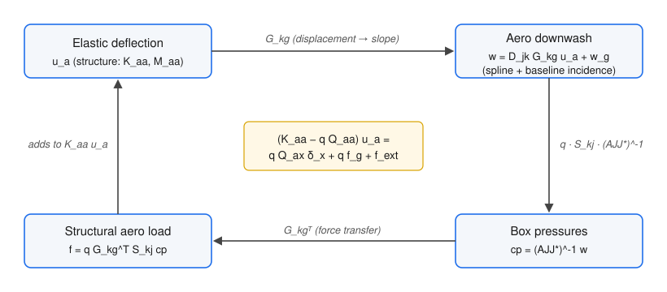
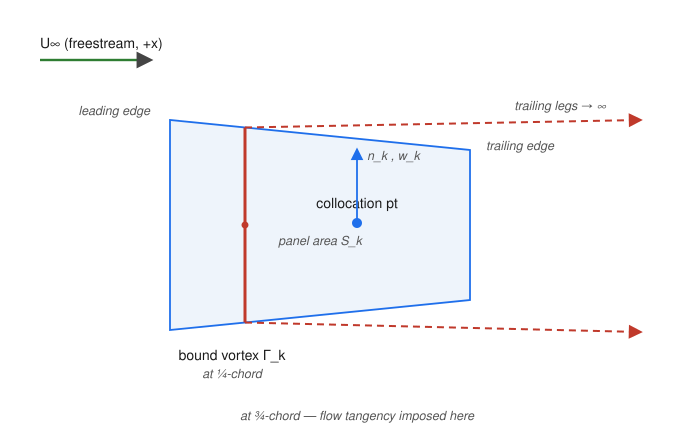
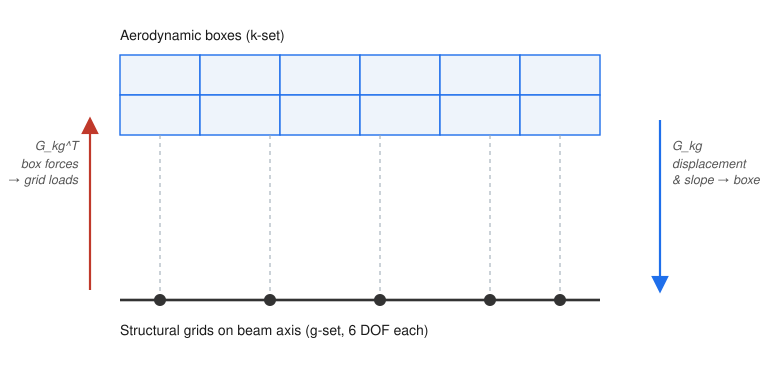
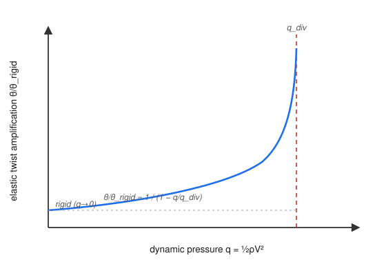
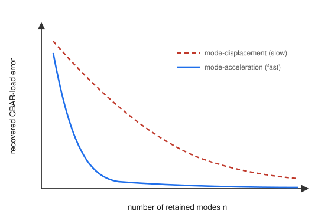
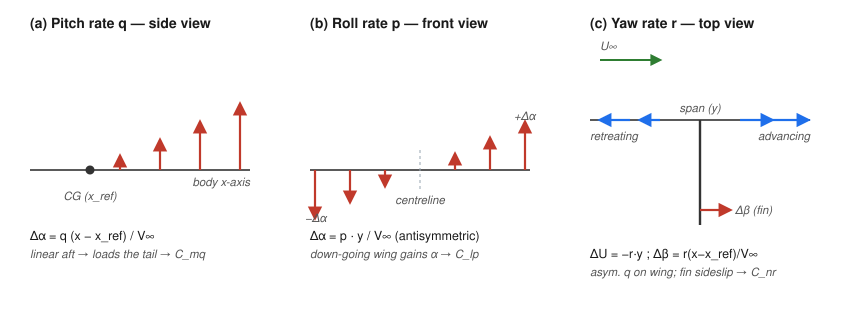

# sbeam — Aeroelastic Analysis: Theory

**Scope of this document.** This is the theoretical reference for the static aeroelastic
capability being added to `sbeam` (Phases A–C of `docs/30_future/01_static_aero_plan.md`): steady
vortex-lattice aerodynamics, aerodynamic corrections from CFD / wind-tunnel data,
structure-to-aero splining, and the SOL 144 static aeroelastic solution (trim, flexible
stability derivatives, divergence), including the modal-truncation reduced-order model. It also
covers **maneuver aerodynamics** to the extent that needs no unsteady solver: the quasi-steady
rate-induced incidence (damping derivatives, balanced maneuver loads) and the analytic
quasi-unsteady corrections (apparent mass, Theodorsen/Wagner strip-lag) — the basis for the
DLM-free maneuver-load path (Phase G0). The fully **3-D unsteady** methods (Doublet Lattice,
flutter, gust, and full transient MLOADS — Phases D–G) are **out of scope** here and are noted
only where the steady/quasi-steady theory feeds them.

It is written to the level and in the notation of the *MSC/NX NASTRAN Aeroelastic Analysis
User's Guide* (Rodden & Johnson) and the *ZAERO Theoretical Manual*, so that the symbols used
in code and in `docs/30_future/01_static_aero_plan.md` cross-reference directly. The structural theory
(Euler–Bernoulli CBAR, consistent mass) is covered in `docs/20_theory/00_beam_methods.ipynb` and only recapped
here where the coupling needs it.

**Conventions.** All aerodynamic geometry is resolved to the global basic coordinate system
(CID 0), consistent with the structural model. The freestream is aligned with the aero
$x$-axis (flow in $+x$). The flow is subsonic, inviscid, irrotational, and linearised about a
small mean incidence; lifting surfaces are flat (camber and twist enter as a prescribed
boundary condition, not as panel geometry). Units are user-defined and must be consistent
throughout. The force- and moment-direction and sign conventions are consolidated in §2.9.

---

## Nomenclature

| Symbol | Meaning |
|--------|---------|
| $q = \tfrac12\rho V^2$ | freestream dynamic pressure |
| $U_\infty$ | freestream speed |
| $\Gamma_k$ | bound circulation of aero box $k$ |
| $c_{p}$, $\Delta c_p$ | pressure coefficient / lifting pressure coefficient on a box |
| $w_j$ | dimensionless **normalwash** (downwash$/U_\infty$) at box $j$ from elastic deflection |
| $w_g$ | dimensionless baseline normalwash slope (camber + twist + incidence + CFD/WT $\Delta\alpha$); positive = washout = less lift (§2.5) |
| $[A_{jj}]$ | aerodynamic influence coefficient (AIC): $\{w_j\}=[A_{jj}]\{c_p\}$ |
| $[A_{jj}^\ast]$ | **corrected** AIC after $W_{kk}$, $W_{T1}$, or $W_{T2}$ |
| $[S_{kj}]$ | integration matrix: box pressures → box normal forces (area weighting) |
| $[D_{jk}]$ | substantial-derivative matrix: box deflection/slope → normalwash |
| $[W_{kk}]$ | diagonal multiplicative AIC correction |
| $[W_{T1}],[W_{T2}]$ | force/moment and pressure correction matrices |
| $[G_{kg}]$ | spline matrix: structural $g$-DOF → aero box deflection & slope |
| $\{P_k\}$ | aerodynamic normal force on each box |
| $[K_{aa}],[M_{aa}]$ | structural stiffness / mass on the analysis ($a$-) set |
| $[Q_{aa}]$ | flexible aerodynamic stiffness on the $a$-set |
| $[Q_{ax}]$ | rigid aero-load sensitivity to trim variables $\delta_x$ |
| $\{f_g\}$ | structural load from the baseline incidence $w_g$ |
| $\Phi$ | retained free-vibration mode matrix (SOL 103) |
| $q_\text{div}$ | divergence dynamic pressure |
| $M$ | freestream Mach number |
| $\beta_{PG} = \sqrt{1-M^2}$ | Prandtl–Glauert compressibility factor |

Subscripts follow the NASTRAN aero degree-of-freedom sets: $j$ = aerodynamic pressure
(collocation) points, $k$ = aerodynamic box (load) points, $g$ = structural grid DOF,
$a$ = the analysis set after constraints.

---

## 1. The aeroelastic problem

Static aeroelasticity is the equilibrium of a **flexible** structure with the aerodynamic
loads its own deformation produces. Aerodynamic load deflects the structure; the deflection
changes the local incidence, which changes the aerodynamic load — a closed feedback loop
(Figure 1). When the elastic restoring stiffness can no longer balance the aerodynamic
stiffening of that loop, the structure **diverges**.

*Figure 1 — The static aeroelastic feedback. Elastic deflection $u_a$ is splined to an aero
downwash $w$; the aerodynamics return a pressure $c_p$ and box loads, which are splined back
to the structure as a load $f$ that adds to the elastic equation. The loop closes into the
governing equation shown at centre.*

Collecting the loop into one statement, with the $g$-set reduced to the analysis $a$-set after
single-point constraints, gives the **static aeroelastic governing equation**:

$$
\big(K_{aa} - q\,Q_{aa}\big)\,u_a \;=\; q\,Q_{ax}\,\delta_x \;+\; q\,f_g \;+\; f_\text{ext}
\tag{1}
$$

where

$$
Q_{aa} = G_{kg}^{\mathsf T}\,S_{kj}\,\big(A_{jj}^\ast\big)^{-1} D_{jk}\,G_{kg},
\qquad
f_g = G_{kg}^{\mathsf T}\,S_{kj}\,\big(A_{jj}^\ast\big)^{-1} w_g .
\tag{2}
$$

The left side is the elastic stiffness **reduced** by the aerodynamic stiffness $q\,Q_{aa}$
(the flexibility-feedback term). The right side is the forcing: aerodynamic loads driven by
the trim variables $\delta_x$ (angle of attack, control-surface deflections, rigid-body
accelerations), the baseline camber/twist/incidence load $f_g$, and any external mechanical
load $f_\text{ext}$.

Three analyses fall out of Equation (1):

- **Trim** — solve for the unknown trim variables $\delta_x$ and the deflection $u_a$ that put
  the aircraft in equilibrium (§5.3).
- **Flexible stability/control derivatives** — the sensitivities $\partial C_L/\partial\alpha$,
  control effectiveness, etc., of the *deformed* aircraft (§5.4).
- **Divergence** — the dynamic pressure at which $(K_{aa}-q\,Q_{aa})$ becomes singular (§5.5).

The remaining sections build each matrix in Equation (2) from first principles: the
aerodynamics $A_{jj}$, $S_{kj}$, $D_{jk}$, $w_g$ (§2), their correction $A_{jj}^\ast$ (§3), the
spline $G_{kg}$ (§4), and then assemble and solve Equation (1) (§5–6).

---

## 2. Steady aerodynamics — the Vortex-Lattice Method

### 2.1 Governing flow and the lifting-surface boundary condition

For inviscid, irrotational, incompressible flow the perturbation velocity potential $\phi$
satisfies Laplace's equation,

$$
\nabla^2\phi = 0 ,
\tag{3}
$$

with the disturbance vanishing far from the surface. (Subsonic compressibility is handled by
the Göthert transformation — see §2.8.) A thin
lifting surface is modelled not by its thickness but by a vortex sheet that supports a pressure
jump. The physical condition is **flow tangency**: the total velocity normal to the surface is
zero,

$$
\big(\mathbf U_\infty + \nabla\phi\big)\cdot \hat{\mathbf n} = 0 .
\tag{4}
$$

Linearising about the freestream and the mean surface, and normalising by $U_\infty$, Equation
(4) becomes the statement that the induced normalwash at each point equals the negative of the
local surface slope relative to the flow — i.e. the prescribed downwash $w$. This is the single
boundary condition the discrete method enforces.

### 2.2 Horseshoe-vortex discretisation

The Vortex-Lattice Method (VLM, NASA SP-405; Katz & Plotkin Ch. 12) discretises the lifting
surface into trapezoidal **boxes**. On each box a *horseshoe vortex* of strength $\Gamma_k$ is
placed: a **bound segment along the box quarter-chord** and two **trailing legs** running
downstream to infinity (Figure 2). Flow tangency, Equation (4), is enforced at a single
**collocation point on the box three-quarter-chord**. The $\tfrac14$c / $\tfrac34$c placement is
not arbitrary — for a flat plate it makes the discrete vortex reproduce the exact 2-D lift and
the exact zero-lift condition (the classic "1/4–3/4 rule"); getting it wrong is the
archetypal silent VLM error.

*Figure 2 — One aero box: bound vortex $\Gamma_k$ at the ¼-chord, trailing legs to downstream
infinity, and the collocation point at the ¾-chord where flow tangency (Equation 4) is imposed.
$\hat{\mathbf n}_k$ is the box outward normal and $S_k$ its area.*

The velocity induced at a point $\mathbf r$ by a straight vortex segment of strength $\Gamma$
follows from the **Biot–Savart law**,

$$
\mathbf v(\mathbf r) = \frac{\Gamma}{4\pi}\int \frac{d\boldsymbol\ell\times(\mathbf r-\mathbf r')}{|\mathbf r-\mathbf r'|^{3}} .
\tag{5}
$$

Summing the bound segment and both trailing legs of box $j$ gives the induced velocity
$\mathbf v_{ij}$ at collocation point $i$ as a linear function of $\Gamma_j$. The AIC entry is
the **full dot product with the receiving panel's outward normal** (ZAERO Eq. 3.49a):

$$
a_{ij} = n_{xi}\,U_{ij} + n_{yi}\,V_{ij} + n_{zi}\,W_{ij}
\tag{5a}
$$

where $(U_{ij}, V_{ij}, W_{ij})$ are the $x$, $y$, $z$ components of $\mathbf v_{ij}$. This
general formulation correctly handles both horizontal surfaces (dominant $n_z$) and vertical
surfaces such as the VTP (dominant $n_y$) with the same code path.

**Bound vortex orientation**: to ensure a consistent sign convention across all surface
types, the bound vortex direction is chosen so that the AIC diagonal entry is always
negative (i.e., the self-induced normalwash is downwash for a horizontal panel, or
an inward sidewash for a vertical panel). The condition
$(b_k - a_k) \times \hat{\mathbf x} \cdot \hat{\mathbf n}_k < 0$
is enforced per box; if violated the end-points $a_k$ and $b_k$ are swapped. For a
horizontal wing (span in $+Y$, $\hat{\mathbf n} = +\hat{z}$) this is automatic; for a
VTP (span in $+Z$, $\hat{\mathbf n} = +\hat{y}$) the bound vortex runs from the upper
tip down to the root (high $Z$ to low $Z$).

### 2.3 The AIC matrix and the pressure solve

Imposing flow tangency at every collocation point yields a linear system for the circulations.
Written in the NASTRAN normalwash form (Rodden & Johnson), the relation between the
dimensionless normalwash $\{w\}$ and the lifting pressure $\{c_p\}$ on the boxes is

$$
\{w\} = [A_{jj}]\,\{c_p\}, \qquad\Longrightarrow\qquad \{c_p\} = [A_{jj}]^{-1}\{w\} .
\tag{6}
$$

$[A_{jj}]$ is the (real, steady, $k=0$) AIC matrix; it is the assembled and normalised form of
the influence coefficients $a_{ij}$. Because VLM is the $k\to0$ limit of the Doublet-Lattice
Method, the **same** box geometry, $S_{kj}$, and $D_{jk}$ built here are reused unchanged in
Phase D — $A_{jj}$ simply becomes complex and frequency-dependent there.

### 2.4 Force integration $S_{kj}$ and the deflection–downwash matrix $D_{jk}$

The normal force on a box is its lifting pressure times its area; the **integration matrix**
$[S_{kj}]$ collects this area weighting so that

$$
\{P_k\} = q\,[S_{kj}]\,\{c_p\} = q\,[S_{kj}][A_{jj}]^{-1}\{w\} .
\tag{7}
$$

This is exactly the ZAERO/Rodden form $\{L\}=q_\infty[A_w][\text{NIC}]^{-1}\{\text{BC}\}$
specialised to flat wing boxes. Each column of $[S_{kj}]$ is the **full 3-component** resultant
$\mathbf F_j = A_j\,c_{p,j}\,\hat{\mathbf n}_j$, with $\hat{\mathbf n}_j$ the geometric box normal —
so on a **non-planar** (dihedral/anhedral) surface canted at $\Gamma$, the right-wing normal is
$(0,-\sin\Gamma,\cos\Gamma)$ and the panel carries a side force $F_y=F_z\,n_y/n_z=\mp F_z\tan\Gamma$
alongside its lift. The effective lift reduces by $\cos\Gamma$ (incidence projection) and the side
force cancels over a symmetric build; both signs of $\Gamma$ are permanently gated by V-C-DIH (see
§5/Step 58 in `docs/10_standard/05_aeroelastics.md`). The **substantial-derivative matrix** $[D_{jk}]$ supplies the
other direction: it maps a box deflection and slope (the geometric boundary condition produced
by structural motion) to the normalwash it induces,

$$
\{w_j\} = [D_{jk}]\,\{u_k\}, \qquad u_k = G_{kg}\,u_a .
\tag{8}
$$

At $k=0$ only the slope term survives ($w$ is the streamwise rate of change of the
out-of-plane deflection); the unsteady plunge term $i k\,h$ is reserved for Phase D. **The
governing convention** — fixed once and used everywhere ($D_{jk}$, $w_g$, $W_{kk}$, the spline)
— is that $w$ is a **dimensionless normalwash** (downwash slope $\Delta z/\Delta x$, with $z$
up and $x$ streamwise). **Positive $w$ is a downwash that *reduces* lift** (a local nose-down /
washout slope); a leading-edge-up incidence, which *increases* lift, is therefore a **negative**
$w$. The spline and the AoA boundary condition are supplied in the natural *incidence* sense
(nose-up positive); the negative sign that turns incidence into the lift-increasing normalwash
lives in $D_{jk}=-I$ (structural motion) and in the ANGLEA column $-n_z$ (rigid AoA). The
baseline $w_g$ (§2.5) is instead given **directly as a normalwash slope** — added to $w$ without
passing through $D_{jk}$ — so its positive sense is the opposite of a nose-up incidence: positive
$w_g$ is washout and unloads the section.

### 2.5 Baseline incidence $w_g$ (camber, twist, built-in incidence)

A real wing carries load even with *zero* elastic deflection, because of airfoil **camber**,
geometric **twist/washout**, and root **incidence**. These appear as a prescribed normalwash
that exists independently of structural motion. Each contribution enters as its local **downwash
slope** $\Delta z/\Delta x$ — the same convention as $w$ (§2.4) — so a nose-up-positive incidence
or twist enters with a *minus* sign, while a camber surface slope (already a $\Delta z/\Delta x$)
enters directly:

$$
w_g(j) = \underbrace{\frac{dz_c}{dx}\Big|_j}_{\text{camber slope}} - \underbrace{\alpha_0}_{\text{incidence}} - \underbrace{\theta_\text{tw}(y_j)}_{\text{twist}} - \underbrace{\Delta\alpha_j}_{\text{CFD/WT correction}} ,
\tag{9}
$$

where $\alpha_0$, $\theta_\text{tw}$ and $\Delta\alpha_j$ are the conventional nose-up-positive
(lift-increasing) angles. The sign of $w_g$ is the normalwash sign of §2.4: **positive $w_g$ is
washout (local nose-down) and *reduces* the section load**; a built-in leading-edge-up incidence
($\alpha_0>0$) is therefore a negative $w_g$. For a conventional configuration this baseline term
carries most of the rigid spanwise load, so it must be modelled — it is the $w_g$ in Equations
(1)–(2). The last term $\Delta\alpha_j$ is an *additive* correction slot (§3): supplying a per-box
incidence delta from CFD or wind-tunnel data is often better conditioned than a multiplicative
correction, because it does not blow up where the local load is small.

**W2GJ card convention (fixed 2026-07-05, AE8a root cause).** The BDF `W2GJ` card carries the
**NASTRAN** sign convention — the *nose-up-positive angles* of Eq. (9), not the normalwash slope:
positive card data is leading-edge-up incidence/camber (more lift), exactly like `ANGLEA`. The MSC
HA144A example fixes this unambiguously: `W2GJ = +0.0017453 rad` is "+0.1 deg wing incidence" and
produces the *positive* lift intercept $C_{z_o}$ of Table 7-1. `build_wg` therefore **negates**
card data on assembly (the same $-1$ the `ANGLEA` column $-n_z$ and $D_{jk}=-I$ apply), so the
internal $w_g$ keeps the Eq. (9) normalwash sign (positive = washout). Card *writers*
(`section_correction`, `body_correction`) apply the matching negation on emission, so generated
correction decks round-trip and are NASTRAN-convention throughout.

### 2.6 Full-span modelling (no symmetry image)

sbeam models every configuration **full-span**: both sides of the $x$–$z$ plane are meshed
explicitly. The half-model-with-image economy of classical codes (where the opposite half is
represented by reflecting each horseshoe vortex across the plane, with a $\pm$ parity to select
symmetric vs antisymmetric loading) is **not** used — it was a 1970s computational economy that
modern hardware makes unnecessary, and removing it eliminates a whole class of half-vs-full-span
reference and force-scaling bugs.

Both symmetric (longitudinal) and antisymmetric (lateral-directional / rolling) flight
conditions are therefore captured directly by the geometry and boundary conditions of the full
model: an asymmetric load — e.g. a single deflected aileron, or a roll rate — produces an
asymmetric circulation distribution naturally, with no image vortices and no parity flag.

### 2.7 Rigid coefficients

With the circulations solved, the section lift coefficient on a spanwise strip is
$c_\ell(y)=2\Gamma(y)/(U_\infty c(y))$, and the integrated coefficients are

$$
C_L = \frac{1}{q\,S_\text{ref}}\sum_k P_k,
\qquad
C_M = \frac{1}{q\,S_\text{ref}\,c_\text{ref}}\sum_k P_k\,(x_\text{ref}-x_k) .
\tag{10}
$$

**Boundary condition — alpha and beta**: for small angles the freestream vector is
$\mathbf U_\infty \approx U_\infty[1,\,\beta,\,\alpha]^{\mathsf T}$, so the right-hand side
of the flow-tangency system is panel-by-panel (ZAERO Eq. 3.28):

$$
w_i = -\mathbf U_\infty \cdot \hat{\mathbf n}_i / U_\infty
    \approx -(\alpha\,n_{zi} + \beta\,n_{yi}) .
\tag{10a}
$$

Horizontal wing panels ($n_z \approx 1$, $n_y \approx 0$) load under $\alpha$; vertical
fin panels ($n_y \approx 1$, $n_z \approx 0$) load under $\beta$. Setting $\beta = 0$
leaves VTP boxes with $w_i = 0$, giving zero Cp — the correct result for a symmetric
fin at zero sideslip.

These rigid results — convergence of $C_{L\alpha}$ with mesh refinement, and decoupled
$\alpha$/$\beta$ loading of horizontal and vertical surfaces — are the standalone
validation of Phase A, before any structure is attached.

---

### 2.8 Prandtl–Glauert / Göthert subsonic compressibility correction

The incompressible Biot–Savart VLM is exact only at $M=0$. For subsonic
compressible flow the linearised velocity-potential equation is

$$
(1-M^2)\,\phi_{xx} + \phi_{yy} + \phi_{zz} = 0 .
\tag{11}
$$

The **Göthert similarity rule** (NACA TM-1105, 1948) shows that (11) maps to
the incompressible Laplace equation under the affine transformation

$$
\bar x = x,\quad \bar y = \beta_{PG}\,y,\quad \bar z = \beta_{PG}\,z,
\qquad \beta_{PG} = \sqrt{1-M^2} .
\tag{12}
$$

The physical wing (span $b$, chord $c$) maps to a **compressed** wing with span
$\beta_{PG}\,b$ in the incompressible equivalent space. The flow-tangency
boundary condition transforms to

$$
\left.\frac{\partial\phi}{\partial\bar z}\right|_{\bar z=0}
= \frac{U_\infty\,\alpha}{\beta_{PG}} ,
\tag{13}
$$

so the effective angle of attack in the compressed problem is $\alpha/\beta_{PG}$.
The pressure coefficient is unchanged under the transformation
($C_p = -2\,\phi_x/U_\infty$ in both spaces), so the **compressible** $C_p$ on
the physical wing equals the **incompressible** $C_p$ on the compressed wing
solved with the enhanced boundary condition.

Combining, the corrected AIC inverse for the physical wing is

$$
\boxed{
[A_{jj}]^{-1}_\text{PG}
= \frac{1}{\beta_{PG}}\;[A_{jj}(\beta_{PG}\cdot\text{geom})]^{-1}
}
\tag{14}
$$

where $[A_{jj}(\beta_{PG}\cdot\text{geom})]$ is the AIC built on the
compressed geometry ($y\to\beta_{PG}\,y$, $z\to\beta_{PG}\,z$) and the
$1/\beta_{PG}$ factor accounts for the boundary-condition scaling in (13).

**2-D limit check.** As $\mathrm{AR} \to\infty$ the compressed wing also has
infinite AR, so $C_{L,\text{incomp}} = 2\pi\alpha$; after the $1/\beta_{PG}$
prefactor, $C_{L,\text{comp}} = 2\pi\alpha/\beta_{PG}$ — the classical 2-D
Prandtl–Glauert result. ✓

**3-D finite wings.** The correction is bounded between $1$ and $1/\beta_{PG}$:
for $M=0.6$ ($\beta_{PG}=0.8$) on an $\mathrm{AR}=8$ rectangular wing the ratio
$C_L^{\text{comp}}/C_L^{\text{incomp}} \approx 1.18$ versus the 2-D limit
$1/0.8=1.25$ — consistent with reduced 3-D compressibility enhancement. The span
compression reduces the effective AR, which partially offsets the 2-D correction.

**Unit-normal invariance.** Under the uniform $(\bar y, \bar z)$ scaling the
panel edge tangent vectors scale by $\beta_{PG}$ identically in both lateral
directions; the cross-product direction (the panel normal) is unchanged.
`AeroBox.normal` is therefore **not** recomputed for the PG geometry.
The area scales by $\beta_{PG}$, but the force-integration matrix $[S_{kj}]$ and
the deflection–downwash matrix $[D_{jk}]$ are built from the **physical** (unscaled)
boxes — the correction affects only the AIC, not the structural coupling geometry.

**Validity.** The rule is linear and subsonic: $M < 1$ strictly, and accuracy
degrades as $M \to 1$ where non-linear transonic effects dominate. sbeam caps
the input at $M = 0.99$ ($\beta_{PG} \ge 0.14$) and does not apply any transonic
or supersonic correction. For $M < 0.3$ the correction is $< 5\%$ (less than
typical VLM modelling error) and can be omitted.

**Input.** Mach is supplied via field 8 of the `AEROS` bulk-data card — an
sbeam extension not present in NASTRAN (where Mach lives on the `TRIM` card).
Default is $M = 0$ (incompressible, $\beta_{PG} = 1$), giving identical results
to the uncorrected solver.

---

### 2.9 Force and moment conventions (summary)

This subsection gathers the force- and moment-direction conventions used throughout the aero
load path (`sbeam/aero/integration.py`, `sbeam/aero/vlm.py`, `sbeam/solver/sol144.py`) into one
place. It restates §2.4, §2.7 and §5.4 because the three questions *which way does a force point*,
*where does it act*, and *what is a moment measured about* are the most common source of
confusion — particularly on swept, tapered and dihedral surfaces.

**Force direction — along the panel normal, not body-$z$ and not the wind axis.** Each box
resultant is the column of $S_{kj}$ (Eq. 7):

$$
\mathbf F_j = q\,A_j\,\Delta c_{p,j}\,\hat{\mathbf n}_j ,
$$

with $\hat{\mathbf n}_j$ the **geometric box outward normal** (built from the corner
cross-product and oriented so its dominant component is positive: horizontal panels $\to +\hat z$,
vertical panels $\to +\hat y$). The force is therefore **normal to the panel surface** — it is
**not** resolved onto the global/body $z$-axis, and it is **not** the wind-axis lift $C_L$ (force
$\perp$ to the freestream). A flat linear-VLM panel carries *only* this surface-normal pressure:
there is no leading-edge suction and no in-plane (chordwise) force.

| Candidate force direction | Vector | Used by sbeam? |
|---------------------------|--------|----------------|
| Body / global $z$ | $\hat z$ (fixed) | ✗ |
| **Surface normal** | $\hat{\mathbf n}_j$ (per panel) | **✓ — this is $S_{kj}$** |
| Wind axis ($C_L$) | $\perp\,\mathbf U_\infty$ | ✗ for force *integration*; **reported** as `CL_wind`/`CD_wind` by rotating the body-axis resultant through $\alpha$ ($C_L=C_Z\cos\alpha-C_X\sin\alpha$; $C_D=C_{Di}$ Trefftz) |

**Body vs wind axis for reporting.** The integrated coefficient summed on global-$z$ is the
**body-axis** $C_Z$ (returned as `CL`/`CZ` by `solve_rigid_cl`, `total_cl` by SOL 144). The
**wind-axis lift** $C_L$ — the force component perpendicular to $\mathbf U_\infty$ — is a distinct
quantity obtained by rotating the body-axis resultant $(C_X,C_Z)$ through the angle of attack:
$C_L=C_Z\cos\alpha-C_X\sin\alpha$ and $C_D=C_X\cos\alpha+C_Z\sin\alpha$. They coincide only at
$\alpha\approx0$. Because a flat-panel VLM carries no leading-edge suction, the body-streamwise
force $C_X\approx0$ and the near-field $C_D$ is unreliable, so the reported wind-axis drag is the
far-field **Trefftz** $C_{Di}$ rather than the near-field projection. sbeam exposes both the
body-axis ($C_Z$) and the genuine wind-axis ($C_L$, $C_D$) coefficients so neither is mislabelled.

**Dihedral enters twice.** On a surface canted at dihedral $\Gamma$ the right-wing normal is
$\hat{\mathbf n}=(0,-\sin\Gamma,\cos\Gamma)$, so (i) the boundary condition that sets the pressure
*magnitude* sees only the vertical projection $w=-(\alpha\,n_z+\beta\,n_y)$ (Eq. 10a) — the
effective incidence is reduced by $\cos\Gamma$; and (ii) the resulting force vector tilts off
vertical, carrying a side force $F_y=F_z\,n_y/n_z=\mp F_z\tan\Gamma$ alongside the lift (§2.4).
The side force cancels over a symmetric build; both signs of $\Gamma$ are gated by V-C-DIH
(Step 58).

**Where the force acts.** Each box force is applied at its **local quarter-chord** — the
bound-vortex midpoint $\mathbf r_j=$ `box.force_point` (the Kutta–Joukowski application point,
AE6), *not* the ¾-chord collocation point. Because every box carries its own swept / tapered /
canted $\mathbf r_j$, the moment arm follows the real planform automatically.

**Moment — application point vs. reference centre.** The aerodynamic moment is the cross-product
resultant about a chosen reference $\mathbf r_\text{ref}$,

$$
\mathbf M = \sum_j (\mathbf r_j - \mathbf r_\text{ref})\times \mathbf F_j ,
\qquad \mathbf r_j = \texttt{box.force\_point},
$$

and the two points must not be confused:

- **Application point $\mathbf r_j$** — the *local* box quarter-chord, **per panel**. This is what
  makes sweep, taper and dihedral correct; nothing surface-specific is done for them.
- **Reference centre $\mathbf r_\text{ref}$** — a **single, aircraft-level point**: the `AEROS`
  `RCSID` origin (the moment reference, conventionally the CG or the quarter-MAC). It is **not**
  each strip's own local quarter-chord (`sol144.py`: `x_ref = RCSID-origin x`; `solve_rigid_cl`
  takes the same `xref`).

The nose-up-positive pitching moment is the single-source arm
$M_y=-\sum_j F_{z,j}\,(x_j-x_\text{ref})$ (`_pitch_moment`, AE1 Step E), nondimensionalised
$C_{MY}=M_y/(S_\text{ref}\,c_\text{ref})$. Roll and yaw use the full 3-component resultant above:
$C_{MX}=M_x/(S_\text{ref}\,b_\text{ref})$, $C_{MZ}=M_z/(S_\text{ref}\,b_\text{ref})$. Because
$\mathbf M$ carries the per-box side force $F_y$, these are correct for canted surfaces with **no**
flat-plate projection (§5.4).

**Two reference-centre exceptions.**
- **Hinge moment** is taken about the control-surface hinge axis $\hat{\mathbf h}$ through the
  hinge origin $\mathbf o$:
  $\mathrm{HM}=\sum_{j\in\text{AELIST}}\big[(\mathbf r_j-\mathbf o)\times\mathbf F_j\big]\cdot\hat{\mathbf h}$ (§5.4).
- **Monitor points** (`MONPNT1`/`MONPNT3`) integrate about the named component's *own* reference
  location, not the aircraft moment reference.

**Frames and units.** All force/moment geometry is in basic CID 0. Through the trim chain the box
forces are carried per unit dynamic pressure (force/$q$ units, $\{P_k\}/q=S_{kj}\{c_p\}$); multiply
by $q$ for physical loads. Exported `FORCE`/`MOMENT` cards are physical (post-$q$) loads in CID 0.

---

## 3. Aerodynamic corrections — matching CFD / wind-tunnel data

VLM is inviscid and linear: it knows nothing of airfoil thickness, viscosity, finite
trailing-edge effects, or local separation, and its lift-curve slope and load distribution
differ from the real aircraft's. The **correction layer** rescales or reshapes the inviscid AIC
so the model reproduces a higher-fidelity load — a CFD solution or a wind-tunnel measurement.
For a configuration whose aerodynamics are pinned by test or CFD, this is the most important
part of the whole method. Three tiers are provided, in increasing fidelity. All are **steady
($k=0$)** corrections, which is exactly what static aeroelasticity needs; the recovery of the
correct *unsteady* (out-of-phase) pressure from a steady correction is a separate problem
(ZAERO's ZTAW successive-kernel-expansion method) reserved for the flutter phase.

### 3.1 Diagonal weighting $W_{kk}$

The cheapest correction multiplies each box's influence by a scalar, tuning the local
lift-curve slope or sweep effect:

$$
A_{jj}^\ast = W_{kk}\,A_{jj}, \qquad W_{kk}=\operatorname{diag}(w_1,\dots,w_N) .
\tag{11}
$$

With $W_{kk}=I$ the inviscid result is recovered. A diagonal weighting cannot reshape a load
distribution — it only scales box-by-box — so it is a local tuning tool, not a way to match a
full CFD/WT load.

### 3.2 Pressure matching $W_{T2}$ (downwash-weighting method)

Following Pitt & Goodman, a **downwash weighting matrix** $W_{T2}$ is sought such that the
corrected AIC reproduces a *given* pressure distribution $\{c_p^\text{given}\}$ (from CFD or
test) for the reference downwash $\{w\}$:

$$
\{c_p^\text{given}\} = [A_{jj}]^{-1}[W_{T2}]\{w\},
\qquad
A_{jj}^{\ast\,-1} = [A_{jj}]^{-1}[W_{T2}] .
\tag{12}
$$

This matches the surface pressure field directly and is the right choice when a chordwise/
spanwise $c_p$ map is available.

### 3.3 Force/moment matching $W_{T1}$ (Giesing method)

When only integrated **section loads** are known — a spanwise lift and pitching/torque
distribution from CFD or a balance measurement — a **force correction matrix** $W_{T1}$ is
sought such that the integrated forces match the given set $\{F^\text{given}\}$:

$$
\{F^\text{given}\} = [L]\,[W_{T1}]\,[A_{jj}]^{-1}\{w\},
\qquad
A_{jj}^{\ast\,-1} = [W_{T1}]\,[A_{jj}]^{-1} ,
\tag{13}
$$

where $[L]$ is the load-integration operator (pressures → section forces/moments). This is the
most robust correction for a conventional wing, because spanwise lift/torque is exactly what
wind-tunnel and CFD campaigns report most reliably.

**sbeam implementation note.** The general $W_{T1}$ above can match a section *moment* as well
as a force by letting the chordwise weighting vary. sbeam's `apply_wt1`, however, uses a single
**per-strip scalar** (uniform across the chord), so it matches only the integrated section
**force**: the chordwise $\Delta c_p$ shape is preserved, the section centre of pressure /
aerodynamic centre is unchanged, and the load it produces is zero at $\alpha=0$ (its target is a
slope, per unit reference normalwash — per rad of $\alpha$ on a horizontal surface, per rad of
$\beta$ on a vertical one, per $\alpha\cos\Gamma$ on a surface canted at dihedral $\Gamma$). To
match **force and moment together** sbeam uses the synthesiser of §3.5 ($W_{T2}$ for the
slope/a.c. and $W_{2GJ}$ for the $\alpha=0$ offset), not a chordwise-varying $W_{T1}$.

These match the ZAERO *Theoretical Manual* §4 forms (its Eqs. 4.55–4.58); $W_{kk}$ is the
diagonal special case of $W_{T2}$.

### 3.4 Using the correction at the operating point

A correction extracted at a reference angle of attack $\alpha_\text{ref}$ implicitly carries the
mean-flow state at that incidence. When CFD/WT pressures are injected as the trim mean-flow
(§5.3, the `CHORDCP` path), the trim solution becomes a **perturbation about
$\alpha_\text{ref}$**, not about the inviscid flat-plate state — the correct way to honour
high-fidelity data end-to-end. The reference incidence must therefore travel with the
correction data.

### 3.5 Section force *and* moment from a section line ($W_{2GJ}+W_{T2}$ synthesis)

Often the available data is not a $c_p$ map but a **section line**: per span strip the four
numbers that define the linear section aerodynamics,

$$
F(\alpha) = \frac{dF}{d\alpha}\,\alpha + F_0,
\qquad
M(\alpha) = \frac{dM}{d\alpha}\,\alpha + M_0 ,
\tag{13a}
$$

i.e. a force-curve slope $dF/d\alpha$, a moment slope $dM/d\alpha$ (equivalently the section
aerodynamic centre), a zero-incidence force offset $F_0=-\,(dF/d\alpha)\,\alpha_0$ (camber lift),
and a zero-incidence pitching moment $M_0$ (camber moment $C_{m0}$). Matching all four — with
**minimal change to the uncorrected chordwise distribution** — requires two of the §3.1–3.3
mechanisms working together, because no single one can do it (§3.3 note):

- The **slope pair** $(dF/d\alpha,\,dM/d\alpha)$ is the response to the $\alpha$-driven
  normalwash; setting the moment slope means moving the chordwise load (the a.c.), so it needs the
  per-box reshaping of **$W_{T2}$**.
- The **offset pair** $(F_0,\,M_0)$ is a load that exists at $\alpha=0$. A $W_{T1}/W_{T2}$
  correction is multiplicative about the unit-incidence reference and yields *nothing* at
  $\alpha=0$, so the offset must enter as a baseline **$W_{2GJ}$** camber-line normalwash (§2.5).

The two compose exactly in the governing solve, $c_p=(A_{jj}^\ast)^{-1}(w_\alpha+w_g)$, with the
correction in the operator and $w_g$ in the normalwash (§2, Eq. 6/9). Because the $W_{T2}$ ratio
is calibrated on the unit-incidence reference $w_\text{ref}=-\mathbf 1$ and is therefore
**independent of $w_g$**, the synthesis is a single pass: size $W_{T2}$ from the slope pair, then
size $W_{2GJ}$ for the offset pair *through the corrected operator* (which also scales the camber
load).

**Minimal change.** Per strip a uniform scale $\bar r=(dF/d\alpha)_\text{tgt}/(dF/d\alpha)_\text{VLM}$
hits the force with **no shape change**; a minimum-norm per-box perturbation $\delta$ orthogonal
to the force ($\sum_k\delta_k\,g_{0,k}=0$, $g_0$ the per-box reference force) supplies *only* the
moment/a.c. mismatch. When the target a.c. equals the VLM a.c. (pure slope scaling) $\delta=0$ and
the result degenerates exactly to the uniform $W_{T1}$ scaling — the chordwise distribution is
untouched. The $W_{2GJ}$ offset is the lowest-order camber that can set $(F_0,M_0)$: a two-mode
line per strip (uniform incidence + chordwise-linear camber), sized by a small global linear solve
so the corrected operator reproduces $(F_0,M_0)$ per strip exactly (inter-strip induction
included).

This is implemented as a preprocessor (`sbeam/aero/section_correction.py`,
`build_section_correction_multi`, with `build_section_correction` the single-surface wrapper) that
emits an ordinary $W_{2GJ}$ + $W_{T2}$ (`AECORR`) card pair **per surface** — no solver or
card-schema change. Because the AIC is global, multiple surfaces are corrected in **one** build: a
per-box $W_{T2}$ ratio (unity on uncorrected boxes) and a **single global** camber-line solve over
all corrected strips (a camber line on one surface induces load on the others). `build_aero_model`
combines the per-surface $W_{T2}$ cards into one global $\Gamma$-target and already accumulates
$W_{2GJ}$ per CAERO1. Each corrected strip requires $\mathrm{NCHORD}\ge 2$ (a moment needs two
chordwise boxes). The pitching moment is nose-up positive about the per-strip moment reference
(default the strip $\tfrac14$-chord; §2.9), and the force targets follow the same
per-unit-reference-normalwash convention as $W_{T1}$ (§3.3 note).

### 3.6 Body cruciform — matching the *total*-aircraft moment ($W_{2GJ}+W_{T2}$ on body panels)

`sbeam` has no body/slender-body element, so a model built only from lifting surfaces misses the
fuselage's contribution to the **whole-aircraft** pitch $C_m$, yaw $C_n$ and roll $C_l$ moments
(lift carry-through, cross-flow, static-margin, directional- and lateral-stability effects). The
classical remedy is a **cruciform**: stand the fuselage in with two crossing flat panels — a
*horizontal* panel (normal $\approx +\hat z$, carrying body lift/pitch) and a *vertical* panel
($\approx +\hat y$, side-force/yaw/roll). They are ordinary `CAERO1`s; what is new is *how they are
tuned*. The flying surfaces are matched to section data (§3.5); the body panels then absorb the
**residual** so the totals match CFD/WT: $C_{m_\alpha},C_{m0}$ (pitch, horizontal panel) and the
sideslip set $C_{n_\beta},C_{n0},C_{l_\beta},C_{l0}$ (yaw + roll, vertical panel). This is
**moment-primary** — the body's own lift/side-force is left at the bare VLM value (a minimum-norm
by-product), matching how airplane totals were historically tuned by correcting the body panels
last. Slope ($W_{T2}$) and offset ($W_{2GJ}$) have **opposite coupling structure**, which dictates
the solution order.

**Slope is decoupled from the flying surfaces (post-inverse, diagonal); joint across the body
panels.** The corrected operator is $(A_{jj}^\ast)^{-1}=\operatorname{diag}(r)\,(A_{jj})^{-1}$, so a
body-box ratio $r_k$ scales *only that box's* $c_p$ — the flying surfaces are **untouched** (their
$c_p$ never multiplies a body $r$). Each moment slope is linear in the body ratios, e.g.

$$
C_{m_\alpha}(r)=C_{m_\alpha}^{\text{base}}+\!\!\sum_{k\in\text{body}}\!\! c_k\,(r_k-1),
\qquad
c_k=-\frac{1}{S_\text{ref}c_\text{ref}}\,(x_k-x_\text{ref})\,A_k\,n_{z,k}\,(A_{jj}^{\ast,-1}w_\alpha)_k ,
\tag{13b}
$$

with $C_{n_\beta}$ using $w_\beta$ and the yaw arm, and $C_{l_\beta}$ using $w_\beta$ and the
**roll arm** $w_{\text{roll},k}\propto(y_k\!-\!y_\text{ref})n_{z,k}-(z_k\!-\!z_\text{ref})n_{y,k}$.
Pitch lives only on the horizontal panel ($n_z=0$ on the vertical) and yaw only on the vertical
($n_y\approx0$ on the horizontal), but **roll couples to both** — the horizontal panel's small
$\beta$-load carries a rolling moment through the $y\,n_z$ term. So the slope is **one joint
minimum-norm system** over all body boxes, $A\,\delta r=d$ with one row per active constraint
(pitch on $c_p^{(\alpha)}$, yaw and roll on $c_p^{(\beta)}$) — exact, force unchanged ($\bar r=1$).

**Offset is coupled (pre-inverse), and must be solved jointly.** $w_g$ enters *before* the inverse,
$c_p=(A_{jj}^\ast)^{-1}w_g$, so body camber induces load on the wing and tail. For a long body panel
under the wing that induced moment is **larger than, and opposite to,** the body's own — a naïve
fixed point that assumes the body's own sign diverges. The cure is to solve against the *actual*
corrected operator: $C_{m0},C_{n0},C_{l0}$ are linear functionals of the body normalwash,

$$
C_{m0}=C_{m0}^{\text{base}}+v_m^{\mathsf T}w_g^{\text{body}},\quad
v_m^{\mathsf T}=-\tfrac{1}{S_\text{ref}c_\text{ref}}\big[(x-x_\text{ref})\!\odot\!A\!\odot\!n_z\big]^{\mathsf T}(A_{jj}^\ast)^{-1},
\tag{13c}
$$

(and the analogous $v_n$, $v_l$ for $C_{n0},C_{l0}$). Stacking the constraints over all body boxes
and taking the **minimum-norm least-squares** solution gives the smallest body camber that hits the
offsets exactly, with the wing induction *accounted for* rather than fought. Because the slope is
fixed first (so $(A_{jj}^\ast)^{-1}$ is frozen) and the offset never feeds back into the slope (the
slope metric is $w_g$-free), the build is **exact and non-iterative**.

The result is ordinary $W_{2GJ}$ + $W_{T2}$ cards on the body CAERO1s (so `build_aero_model` is
unchanged). Implemented in `sbeam/aero/body_correction.py` (`build_body_correction`); the body panels
carry **`SPLINE0`** (zero structural coupling) so the fictitious tuning load is not smeared onto the
fuselage beam — yet they still drive the total/trim $C_m,C_n,C_l$ and all rigid + restrained
derivatives, which integrate every box directly (independent of the spline; §4.4, §5).

**Authority and contamination are the same mechanism — keep the panels clear of the tail.** The
cruciform's ability to *move the total moment* and its tendency to *spuriously load the real
surfaces* both come from one thing: how strongly the body panels couple to the rest of the lattice
through $A_{jj}$. A panel **overlapping** the empennage (or one whose semi-infinite $+\hat x$ trailing
legs **pierce** it — for the vertical panel, sharing the fin's $y=0$ plane, any box in the fin's
$z$-band drives a sidewash straight onto the fin) is strongly coupled, so it reaches the targets at a
small $W_{T2}$ ratio — *but that small ratio is bought by dumping load onto the HTP/VTP*. Hold the
panels clear and the coupling collapses: the targets now need a large ratio, which is **benign for the
lifting surfaces** (the slope $W_{T2}=\operatorname{diag}(r)A^{-1}$ touches body rows only, eqn 13b)
and keeps the body $c_p$ of the same order as the real surfaces (it scales a tiny bare value), but it
exposes the real limit — see below. So `ratio_max` is a *conditioning* gauge, **not** a contamination
gauge; it is warned only past a large bound, signalling the targets exceed the cruciform's range.

**A flat-plate cruciform can only legitimately supply a small body increment.** A flat plate aft of
the moment reference makes a *stabilising* (nose-down) bare $C_{m_\alpha}$ — the **wrong sign** for a
fuselage's destabilising Munk moment — and a clear-of-tail panel has little authority, so a large
destabilising target is reachable only by re-introducing the overlap (spurious) or by an extreme,
weakly-conditioned correction. The cruciform is therefore a tuning device for a **mild** $C_{m_\alpha}$
and $C_{n_\beta}$ increment with **$C_{l_\beta}\approx0$** (a slender body adds negligible roll; the
match capability remains but a clean cruciform drives it to ~0). A genuine fuselage representation —
the destabilising couple, wing-body interference, a several-MAC neutral-point shift — requires a true
**slender-body element** (line of acceleration-potential doublets, Munk slender-body theory), tracked
in `docs/30_future/00_backlog.md`. Matching $C_{l_\beta}$ at all still needs adequate spanwise ($z$)
resolution on the vertical panel to shape the roll arm independently of the yaw arm.

### 3.7 Decoupled strip body — load and boundary condition as *separate* blocks

The cruciform's bind (§3.6) is an identity: a flat panel's **authority** to move the total moment
and its **contamination** of the lifting surfaces are the *same* off-diagonal coupling. Write the
combined influence operator in $[\text{wing+tail} \;;\; \text{body}]$ block form,

$$
\mathbf{A}^{-1}_{\text{corr}} =
\begin{bmatrix} \mathbf{A}^{-1}_{WW} & \mathbf{A}^{-1}_{WB} \\[2pt]
                \mathbf{A}^{-1}_{BW} & \mathbf{A}^{-1}_{BB} \end{bmatrix},
$$

A body that loads the wing has $\mathbf{A}^{-1}_{WB}\neq0$ (contamination); a body that *reacts* to
the wing — a no-through-flow boundary condition — has $\mathbf{A}^{-1}_{BW}\neq0$. The two are
inseparable for any element built from a circulation/horseshoe singularity. A flat cruciform fuses
them and gets the interference sign wrong.

The **decoupled strip body** breaks the fusion by giving the body **no singularity at all**: it
sheds no vortex and has no wake, so $\mathbf{A}^{-1}_{WB}=\mathbf{A}^{-1}_{BW}=\mathbf 0$ and the
body block is purely diagonal,

$$
\mathbf{A}^{-1}_{BB} = \operatorname{diag}\!\big(-\,\text{slope}_i/\beta\big), \qquad
\Delta C_{p,i} = \text{slope}_i\,(\alpha\,n_{z,i} + \beta\,n_{y,i} + \Delta\alpha_i).
$$

Each box is an independent 2-D strip ($\text{slope}\approx\pi$ ⇒ a sectional lift-curve slope of
$\pi$, half the $2\pi$ flat plate). Because $\mathbf{A}^{-1}_{WB}=\mathbf 0$, the strip **cannot
contaminate** the lifting surfaces — they are untouched no matter where the strip sits, even on top
of the wing (proved in `tests/aero/test_strip_body.py`). Because $\mathbf{A}^{-1}_{BW}=\mathbf 0$,
it also carries **no interference / fence effect** — a decoupled element is transparent to the
wing's flow. A strip body is thus a pure *load* device, tuned (per-box slope via `STRIPK`, per-box
$\Delta\alpha$ via `W2GJ`) to the total-aircraft targets, with no conditioning gauge to watch.

The complementary half — the body acting as a **fence** (the wing box must not blow through the
fuselage, $\mathbf{A}^{-1}_{BW}\neq0$) — is, by the identity above, *necessarily* coupling. It can be
added to the lifting surfaces **without new unknowns** by the **method of images**: reflect each wing
horseshoe across the body surface (mirrored geometry, reversed circulation, à la ground effect) and
add the image contribution into $\mathbf{A}^{-1}_{WW}$. That is the same machinery as the trailing
wake already in `horseshoe_influence` (extra Biot–Savart terms tied to the box's own $\Gamma$, no new
unknowns), but enforcing no-penetration (transverse reflection) rather than the Kutta condition
(streamwise shedding). It is a *physical* reflection, not the cruciform's wrong-sign contamination —
so load (strip) and boundary condition (image fence) become two correct, composable mechanisms. The
image fence is tracked in `docs/30_future/00_backlog.md`; only the strip load device is implemented.

---

## 4. Structure-to-aerodynamics coupling — splines

The structural and aerodynamic meshes are independent: structural grids sit on the beam axis;
aero boxes tile the planform. A **spline** interpolates between them. Two transfers are needed
and they must be **energy-consistent** with each other.

*Figure 3 — The spline maps structural grid motion down to aero box deflection/slope through
$G_{kg}$, and maps aero box forces back up to structural grid loads through $G_{kg}^{\mathsf T}$.
Using the transpose for the force transfer guarantees virtual-work consistency.*

### 4.1 Displacement interpolation and the virtual-work force transfer

Let the aero box motion be a linear interpolation of the structural grid DOF,

$$
u_k = [G_{kg}]\,u_g .
\tag{14}
$$

The force transfer is **not** chosen independently. Requiring that the aerodynamic loads do the
same virtual work whether expressed on the aero or the structural mesh,

$$
\delta u_g^{\mathsf T} f_g = \delta u_k^{\mathsf T} P_k
= \delta u_g^{\mathsf T} G_{kg}^{\mathsf T} P_k
\quad\Longrightarrow\quad
f_g = [G_{kg}]^{\mathsf T} P_k ,
\tag{15}
$$

forces the load transfer to be the **transpose** of the displacement interpolation. This single
fact (Equation 15) is what makes the coupled matrix $Q_{aa}$ in Equation (2) consistent and is
why the spline must be built once and used both ways.

### 4.2 Beam spline (SPLINE2) — primary for `sbeam`

Because `sbeam` idealises structures as beams, the natural spline is one-dimensional. A
**beam spline** fits a smoothing spline along a reference axis through the structural grids,
carrying both bending **deflection + slope** and **torsional rotation**. The aero box
out-of-plane deflection and incidence are then read off the spline at the box location, with
the torsion-to-incidence coupling set by the spline's $D_{\theta x}/D_{\theta z}$ ratios. This
is the exact match for the CBAR's bending+torsion DOF and is the primary $G_{kg}$ builder.

### 4.3 Surface spline (SPLINE1) — optional

For grids scattered in 2-D (a plate-like idealisation), the Harder–Desmarais **Infinite-Plate
Spline** interpolates a surface that minimises bending energy:

$$
w(x,y) = a_0 + a_1 x + a_2 y + \sum_i F_i\, r_i^2 \ln r_i^2,
\qquad r_i^2 = (x-x_i)^2 + (y-y_i)^2 .
\tag{16}
$$

The polynomial part carries rigid translation and the two rigid rotations; the $r^2\ln r^2$
kernel carries the elastic deformation. It is heavier than the beam spline and is included only
where a single beam axis is a poor fit.

### 4.4 Rigid-body attachment (ATTACH) and zero-displacement (SPLINE0)

Box groups with no local structural grid — control surfaces, tips, nacelles/pylons — are tied
**rigidly** to a master grid: the box motion is the master-grid rigid-body motion evaluated at
the box (a lever-arm transform). In `sbeam` this reuses the existing `RBE2`/`RBE3` rigid-body
machinery rather than a new kinematic implementation. Pinned boxes (`SPLINE0`) simply have a
zero row in $G_{kg}$.

### 4.5 The rigid-body exactness requirement

Whatever the method, $G_{kg}$ **must reproduce rigid-body motion exactly**: a rigid translation
of the structure must give uniform box deflection and *zero* induced incidence, and a rigid
rotation must give the exact rigid slope field. If it does not, a spurious downwash appears
under rigid motion and the flexible aero load is corrupted at the root. This is the make-or-break
gate of the coupling and must hold to machine precision; a linear (twist) field should likewise
be reproduced exactly by the beam spline.

---

## 5. Static aeroelastic solution (SOL 144)

### 5.1 The flexible aerodynamic stiffness $Q_{aa}$

Chaining the pieces — spline structural motion to box deflection (Equation 14), convert to
normalwash (Equation 8), solve for pressure on the *corrected* AIC (Equation 6/§3), integrate
to box forces (Equation 7), and transfer back to the structure (Equation 15) — gives the
aerodynamic load produced *by the structure's own deflection*:

$$
f_\text{aero} = q\,\underbrace{G_{kg}^{\mathsf T} S_{kj} (A_{jj}^\ast)^{-1} D_{jk} G_{kg}}_{Q_{aa}}\; u_a .
\tag{17}
$$

$Q_{aa}$ is the flexible aerodynamic stiffness of Equation (2). It is **dense** (every box
influences every other through $A_{jj}^{-1}$) and, in general, **unsymmetric**. It is reduced
from the $g$-set to the analysis $a$-set with the same constraint and rigid-element transforms
used by the structural assembly, then added to the sparse $K_{aa}$ along the existing
dense-fallback path.

### 5.2 The coupled equation, revisited

Moving the deflection-dependent aero load to the left of the equilibrium statement reproduces
Equation (1):

$$
\big(K_{aa} - q\,Q_{aa}\big) u_a = q\,Q_{ax}\,\delta_x + q\,f_g + f_\text{ext} .
$$

The physical content is that aerodynamics **softens** the structure: as $q$ rises, the
effective stiffness $K_{aa}-q\,Q_{aa}$ falls. For $q\to0$ the aero terms vanish and Equation
(1) collapses to the ordinary linear static problem $K_{aa}u_a=f_\text{ext}$ (SOL 101) — the
identity check that anchors the whole implementation.

### 5.3 Trim

Trim finds the flight state in equilibrium. The unknowns are the structural deflection $u_a$
and the free **trim variables** $\delta_x$: rigid-body states (angle of attack `ANGLEA`, pitch
rate, normal acceleration `URDD3`, …) and control-surface deflections (`AESURF`). They are
constrained by the trim card — some $\delta_x$ are fixed (e.g. a commanded load factor), the
rest are solved so that the net aerodynamic + inertial forces and moments balance. Augmenting
Equation (1) with the rigid-body equilibrium equations gives the trim system

$$
\begin{bmatrix} K_{aa}-q\,Q_{aa} & -q\,Q_{ax} \\[2pt] \text{(rigid-body equilibrium rows)} \end{bmatrix}
\begin{Bmatrix} u_a \\ \delta_x \end{Bmatrix}
=
\begin{Bmatrix} q f_g + f_\text{ext} \\ \text{prescribed loads / accelerations} \end{Bmatrix} .
\tag{18}
$$

- **Determined trim** — the number of free trim variables equals the number of equilibrium
  equations; Equation (18) is square and solved directly. The longitudinal DOF (NX, NZ, pitch)
  and lateral DOF (NY, roll, yaw) decouple, and each block needs a matching count of trim
  variables or the system is singular.
- **Over-determined trim** — more trim variables than equations (e.g. several redundant control
  effectors). The solution minimises a user objective $\text{Obj}=\sum_i (C_{1i}F_i - S_{1i})^{e_{1i}}\!+\dots$
  over the trim functions $F_i$, subject to inequality constraints $G_i = (F_i-S_i)^{e_i}\lessgtr V_i$,
  with bounds and an initial guess on each variable. The square case is the special case with no
  free objective. (This is the ZAERO `TRIMOBJ`/`TRIMCON`/`TRIMVAR` formulation.) *sbeam
  implementation:* the equilibrium equations are eliminated by a null-space reduction
  $\delta=\delta_p + N z$ ($N=\operatorname{null}(\text{schur}_A)$, so equilibrium holds for any
  $z$); the redundancy coordinate $z$ then minimises the convex weighted-L2 objective
  $J=\sum_i w_i\,\delta_i^2$ subject to the TRIMCON/TRIMVAR bounds (small, well-scaled SLSQP).
  The null-space form keeps the stiff $O(10^3)$ structural-force equilibrium rows out of the
  optimiser; convexity makes the optimum initial-guess insensitive.

**CFD/WT mean-flow injection.** Optionally the program-computed mean-flow load is replaced by a
supplied steady pressure/section-load distribution at a stated $\alpha_\text{ref}$ (§3.4): the
trim then perturbs about the measured operating point.

### 5.4 Flexible vs. rigid derivatives

A **stability or control derivative** is the load response to a unit trim variable. Solving
Equation (1) with $f_\text{ext}=0$, $f_g=0$, and a unit $\delta_x$ (say $\alpha=1$) gives the
deformation and hence the *flexible* derivative,

$$
\left.\frac{\partial C_L}{\partial\alpha}\right|_\text{flex}
= \frac{1}{qS_\text{ref}}\,\mathbf 1^{\mathsf T} S_{kj}(A_{jj}^\ast)^{-1}\big(D_{jk}G_{kg}\,u_a^{(\alpha)} + w_g^{(\alpha)}\big) .
\tag{19}
$$

The **rigid** derivative is the same with the structure held rigid (formally $K_{aa}\to\infty$,
or $q\to0$ in the feedback). Their ratio — the *aeroelastic efficiency*
$\big(\partial C_L/\partial\alpha\big)_\text{flex}\big/\big(\partial C_L/\partial\alpha\big)_\text{rigid}$
— is the headline flexible-aircraft result and is what the HA144-class verification cases check.

**Trim-variable normalwash columns.** Each column of $D_{jx}$ is the box normalwash per unit trim
variable. Angle-of-attack and sideslip act through the box normal ($-n_z$, $-n_y$); the rate
variables are their station-weighted analogues. Pitch rate gives $-(2/c_\text{ref})(x-x_\text{ref})$
on a lifting surface; **yaw** rate produces a *sidewash* $\propto (x-x_\text{ref})$ sensed only by
vertical surfaces, hence $-(2/b_\text{ref})(x-x_\text{ref})\,n_y$ — it vanishes on horizontal panels
and is **not** the roll column $-(2/b_\text{ref})\,y$. A control deflection rotates the box about its
hinge axis $\hat{\mathbf h}$ (the surface's hinge coordinate-system y-axis), giving the streamwise
normalwash $-(\hat{\mathbf h}\times\mathbf n)\cdot\hat{\mathbf x}\,\cdot\text{eff}$, which reduces to
the flat-plate flap result $-n_z\,\text{eff}$ when the hinge is spanwise ($\hat{\mathbf h}=\hat{\mathbf y}$).

**Lateral / directional moment derivatives.** The longitudinal derivatives use $C_Z=F_z/S_\text{ref}$
and the nose-up pitch arm $C_{MY}=M_y/(S_\text{ref}c_\text{ref})$; the roll/yaw derivatives use the
full 3-component cross-product resultant $\mathbf M=\sum_j(\mathbf r_j-\mathbf r_\text{ref})\times
\mathbf F_j$ about the aero reference, giving $C_{MX}=M_x/(S_\text{ref}b_\text{ref})$ and
$C_{MZ}=M_z/(S_\text{ref}b_\text{ref})$. From these: roll damping $C_{lp}=\partial C_{MX}/\partial p$,
yaw damping $C_{nr}=\partial C_{MZ}/\partial r$, and the dihedral effect $C_{l\beta}=\partial C_{MX}
/\partial\beta$ — the last being identically zero for a planar wing and non-zero (sign set by $\pm\Gamma$)
once the box normals leave the $xy$-plane (§ dihedral). Because $\mathbf M$ carries the per-box side
force $F_y$, these are correct for canted surfaces without a flat-plate projection.

**Restrained vs unrestrained (mean-axis) flexible columns (AE8b, 2026-07-05).** *(Tutorial
treatment of all three derivative columns, for readers new to the topic:
[`aeroelastic_derivatives.md`](aeroelastic_derivatives.md).)* The flexible
derivative of Eq. (19) with the SUPORT DOFs held ($u_r=0$) is the **restrained** column
(`_compute_restrained_derivs`). NASTRAN additionally prints an **unrestrained** column — the
free-flight derivative, made SUPORT-location-invariant by the **mean axis**: the frame in which
elastic deformation moves neither the CG nor the principal axes, i.e. displacements are
mass-orthogonal to the rigid-body modes. sbeam implements the MSC SOL 144 algorithm verbatim
(MSC Aeroelastic Analysis User's Guide, Eqs. 2-111…2-134; `_compute_unrestrained_derivs`).
With $D=-K_{ll}^{-1}K_{lr}$ (structural rigid-body modes), $m_r$ the total rigid mass about the
SUPORT, and $K^a=K-qQ$ the aeroelastic stiffness, the three-block system in $(u_l,u_r,\ddot u_r)$
is: the l-set equilibrium, the **mean-axis constraint**
$(D^{\mathsf T}M_{ll}+M_{rl})u_l+(D^{\mathsf T}M_{lr}+M_{rr})u_r=0$, and the rigid equilibrium row.
Eliminating $u_l$ through $K^a_{ll}$ and $u_r$ through the *mass-weighted* mean-axis row leaves
$\mathrm{MIRR}\,\ddot u_r+\mathrm{KR1ZX}\,u_x=\mathrm{IPZF}$; the printed derivative is the
rigid-body inertial reaction per unit trim variable,
$Z1ZX=-m_r\,\mathrm{MIRR}^{-1}\,\mathrm{KR1ZX}$, non-dimensionalised like Eq. (19). The
equivalent modal statement (ZAERO Theoretical Manual Ch. 12, Eqs. 12.9–12.16 — used as an
independent numerical cross-check, agreement to 4+ decimals) is

$$
C_\text{unrest} \;=\; \frac{1}{qS}\,\phi_r^{\mathsf T}\Big[\;\frac{\partial f}{\partial a}
\;+\; q\,Q\,\phi_e\big(K_{ee}-q\,Q_{ee}\big)^{-1}\phi_e^{\mathsf T}\,\frac{\partial f}{\partial a}\Big],
$$

with the elastic solve restricted to modes **mass-orthogonal to the rigid modes**
($\phi_e^{\mathsf T}M\phi_r=0$ kills the inertia-relief load in the derivative operator) and the
rigid modes only *projecting* the force. Neither a load-projector on a restrained solve nor a
converged free-free solve $\;(K-P\,qQ)^{-1}$ is the printed quantity — both were tried and
reverted (see `docs/40_history`, Step AC2). Ordering: unrestrained > restrained > rigid for
$C_{Z_\alpha}$ (the free vehicle washes *in*). Validation: all six longitudinal columns and the
$w_g$ intercepts match MSC Table 7-1 within 1% at $q=40$; the $q=1200$ comparison is gated by the
upstream high-q flexible-coupling fidelity item (backlog AC7/AE14), not by this operator.

**Hinge moments.** The hinge moment of a control surface is the moment of its box forces about the
hinge axis through the hinge origin $\mathbf o$,
$\mathrm{HM}=\sum_{j\in\text{AELIST}}\big[(\mathbf r_j-\mathbf o)\times\mathbf F_j\big]\cdot\hat{\mathbf h}$,
with $\mathbf r_j$ the box ¼-chord force point. Per trim variable, $\partial\mathrm{HM}/\partial\delta$
uses the box forces from that variable's normalwash column alone — the control-column entry gives the
restoring (control-effectiveness) hinge-moment derivative, the $\alpha$ column the floating tendency.

### 5.5 Divergence

Divergence is the static instability where the aerodynamic softening exactly cancels the
elastic stiffness: the homogeneous form of Equation (1) has a non-trivial solution when

$$
\det\!\big(K_{aa} - q\,Q_{aa}\big) = 0 ,
\tag{20}
$$

i.e. the generalised eigenvalue problem

$$
K_{aa}\,\phi = q\,Q_{aa}\,\phi .
\tag{21}
$$

The **divergence dynamic pressure** $q_\text{div}$ is the smallest positive real eigenvalue, and
$\phi$ is the divergence mode shape; the divergence speed follows from $q_\text{div}=\tfrac12\rho V_\text{div}^2$.
As $q\to q_\text{div}$ the elastic deformation grows without bound (Figure 4). Because $Q_{aa}$ is
unsymmetric, Equation (21) can return complex or negative eigenvalues that are not physical
divergence; the selection rule is *smallest positive real*. The forcing terms ($f_g$, $Q_{ax}$)
do **not** enter Equation (21) — divergence is a property of $K_{aa}$ and $Q_{aa}$ alone.

For a free-flight (SUPORT) model the full a-set $K_{aa}$ is singular, so Equation (21) is
solved on the **restrained l-set** (SUPORT DOFs removed): $K_{ll}\,\phi = q\,Q_{ll}\,\phi$.
Rewritten as the standard problem $(K_{ll}^{-1}Q_{ll})\,x = (1/q)\,x$, the eigenvalues are
$1/q$; the lowest $\texttt{NROOTS}$ divergence pressures are the reciprocals of the largest
real-positive eigenvalues, taken in ascending $q$. This is the `DIVERG`-card sweep
(`sol144.run_sol144_diverg` / `_divergence_roots`); each retained eigenvector $\phi$ is the
divergence mode shape, expanded back to the g-set, and $V_\text{div}=\sqrt{2\,q_\text{div}/\rho}$
when a reference density `RHOREF` is supplied.

*Figure 4 — Elastic twist amplification $1/(1-q/q_\text{div})$ versus dynamic pressure. The
deformation is finite and small at low $q$ and grows without bound as $q\to q_\text{div}$ — the
static-aeroelastic instability.*

The closed-form checks are the uniform cantilever wing (Bisplinghoff analytical $q_\text{div}$)
and the Goland wing.

---

## 6. Reduced-order model — modal truncation

For large models, or to share one consistent reduced model with the later flutter phase, the
$a$-set system is projected onto a small set of **free-vibration modes** $\Phi$ computed by
SOL 103. This is the **modal-truncation** ROM (the chosen reduction method for `sbeam`).

### 6.1 Modal projection

Writing $u_a = \Phi\,\xi$ with $\xi$ the generalised coordinates, and pre-multiplying Equation
(1) by $\Phi^{\mathsf T}$,

$$
\big(\Phi^{\mathsf T}K_{aa}\Phi - q\,\Phi^{\mathsf T}Q_{aa}\Phi\big)\xi
= \Phi^{\mathsf T}\big(q\,Q_{ax}\delta_x + q\,f_g + f_\text{ext}\big) .
\tag{22}
$$

$\Phi^{\mathsf T}K_{aa}\Phi$ is diagonal (modal stiffnesses $\omega_i^2 m_i$); $\Phi^{\mathsf T}Q_{aa}\Phi$
is the generalised aerodynamic stiffness. For a **free aircraft** the basis must include the six
rigid-body modes (zero-frequency) alongside the retained elastic modes, with inertia relief
carried by the rigid-body partition consistent with the `AESTAT` trim states. Divergence,
Equation (21), reduces identically to $\Phi^{\mathsf T}K_{aa}\Phi\,\eta = q\,\Phi^{\mathsf T}Q_{aa}\Phi\,\eta$.

**The generalised aerodynamic force (GAF) matrix.** The modal-projected aerodynamic term

$$
Q_{hh} \;\equiv\; \Phi^{\mathsf T}Q_{aa}\Phi
\;=\; \Phi^{\mathsf T} G_{kg}^{\mathsf T} S_{kj}\big(A_{jj}^\ast\big)^{-1} D_{jk}\,G_{kg}\,\Phi
\tag{22a}
$$

is the **steady ($k=0$) generalised aerodynamic force matrix** $Q_{hh}(0)$ — the aerodynamics
expressed on the modal basis, of size (retained modes)$^2$ and independent of the aero mesh size.
It is the object the flutter phase reuses: when Phase D replaces the real $A_{jj}$ with the complex
Doublet-Lattice $A_{jj}(M,k)$, the *same* expression returns the frequency-dependent $Q_{hh}(M,k)$
with no change to $S_{kj}$, $D_{jk}$, $G_{kg}$, or $\Phi$ (ZAERO Eq. 2.20; this is the matrix written
$[Q_{hh}(ik)] = [\Phi]^{\mathsf T}[G]^{\mathsf T}[S_{kj}][\text{AIC}(ik)][G][\Phi]$ there).

Note **where the correction enters**: the CFD/WT correction lives entirely in $A_{jj}^\ast$ (§3),
*upstream* of the modal projection, and $Q_{hh}$ inherits it automatically. There is no separate
correction applied to the GAF — and none should be. Once the aerodynamics are reduced to the modal
basis, the per-box pressure field that $W_{kk}/W_{T1}/W_{T2}$ act on no longer exists, and the
distributed-load recovery that $S_{kj}$ and $G_{kg}^{\mathsf T}$ provide is lost. Correcting the AIC
is what keeps the recovered physical loads and the modal $Q_{hh}$ mutually consistent.

**Caveat for the flutter handoff.** A steady correction baked into $A_{jj}^\ast$ supplies the correct
*in-phase* pressure but not the *out-of-phase* pressure of the unsteady $Q_{hh}(M,k)$ (ZAERO §4,
"Shortcoming of the AIC Correction Method"); recovering the latter is the separate ZTAW problem and
is irrelevant at $k=0$. The steady $Q_{hh}(0)$ built here is therefore exact for trim, divergence, and
static loads, and is an in-phase-only approximation if reused directly in flutter.

### 6.2 Static-load recovery — the mode-acceleration method

Modal truncation has a well-known trap for *static* problems: recovering the deflection as
$u_a=\Phi\,\xi$ (the **mode-displacement** method) converges slowly, because the truncated
high-frequency modes still carry real static flexibility that the load needs. Recovered CBAR
loads from a mode-displacement solution can be badly wrong even when the displacement looks
converged.

The fix is the **mode-acceleration method**: add the static flexibility correction by passing
the residual force through the full stiffness,

$$
u_a = \Phi\,\xi + K_{aa}^{-1}\Big(f - \big(K_{aa}-q\,Q_{aa}\big)\Phi\,\xi\Big),
\qquad f = q\,Q_{ax}\delta_x + q\,f_g + f_\text{ext} .
\tag{23}
$$

The bracket is the residual that the truncated modes fail to balance; $K_{aa}^{-1}$ restores the
missing static flexibility exactly (it reuses the factorisation already formed for the direct
solve, so the correction is cheap). Equivalently, $\Phi$ is augmented with **residual
(attachment) vectors** generated from the $Q_{ax}$, $f_g$, and $f_\text{ext}$ load patterns.
CBAR loads are then recovered from the corrected $u_a$. **Mode-acceleration recovery is
required, not optional**, for static aeroelastic loads.

*Figure 5 — Recovered-load error versus number of retained modes. Mode-displacement recovery
converges slowly; mode-acceleration recovery converges with very few modes — the demonstration
that the static residual correction is doing its job.*

### 6.3 Cost and use

For `sbeam`'s beam idealisations the $a$-set is small and the **direct solve of Equation (1) is
the default** — it is exact and cheap, and needs no recovery correction. The modal ROM is the
optional path for large interiors, for interfacing with externally reduced models, and as the
basis the flutter phase will reuse.

---

## 7. Maneuver aerodynamics — quasi-steady and quasi-unsteady

A maneuvering aircraft is a *dynamic* problem, but much of the maneuver-load content can be
captured without the unsteady Doublet-Lattice machinery of Phase D. This section sets out the
hierarchy: the **quasi-steady** rate-induced incidence (which the steady VLM of §2 already
handles, and which supplies the damping derivatives), and the cheap analytic **quasi-unsteady**
corrections (apparent mass, wake lag) that extend the usable frequency range short of a full
3-D unsteady solve.

### 7.1 The reduced-frequency hierarchy

The single parameter that orders the methods is the **reduced frequency**

$$
k = \frac{\omega\, c}{2\,V_\infty},
\tag{24}
$$

the ratio of the time a fluid particle spends over a chord to the period of the motion. Four
regimes follow:

- **Steady** ($k=0$): the VLM/AIC of §2 — the static trim and divergence of §5.
- **Quasi-steady** ($k\to0$, rates present, no flow memory): rigid-body rates produce a local
  incidence field that the *steady* VLM evaluates directly (§7.2). This is the source of the
  damping derivatives and of low-frequency maneuver loads.
- **Quasi-unsteady**: add the **apparent-mass** (acceleration-dependent) loads and a 2-D
  **wake-lag** correction by strip theory (§7.4–7.6), still without a 3-D unsteady solve.
- **Fully unsteady** ($k=O(1)$): the complex AIC $A_{jj}(k,M)$ of the Doublet-Lattice Method —
  required for flutter, gust, and high-rate inputs (Phase D, out of scope here).

### 7.2 Rigid-body rates as a local incidence field

A rigid-body angular velocity $\boldsymbol\Omega = [p,q,r]$ about the reference point gives every
aerodynamic box a local velocity $\boldsymbol\Omega\times\Delta\mathbf r$, with
$\Delta\mathbf r = \mathbf r_\text{box}-\mathbf r_\text{ref}$. Projected on the box normal and
normalised by $V_\infty$, this is an incremental normalwash — exactly the kind of boundary
condition the steady VLM consumes (a new column of $w_g$, §2.5):

$$
\Delta w = (\boldsymbol\Omega\times\Delta\mathbf r)\cdot\hat{\mathbf n},
\qquad
\Delta\alpha = \frac{\Delta w}{V_\infty}.
\tag{25}
$$

Resolving the three rates for a conventional configuration (Figure 6):

$$
\text{pitch rate:}\quad \Delta\alpha(x) = \frac{q\,(x-x_\text{ref})}{V_\infty}
\tag{26}
$$

a streamwise-linear incidence — stations aft of the CG see more incidence, which is why the
horizontal tail dominates the pitch-damping derivative $C_{m_q}$;

$$
\text{roll rate:}\quad \Delta\alpha(y) = \frac{p\,y}{V_\infty}
\tag{27}
$$

an *antisymmetric* spanwise incidence (the down-going wing gains incidence), giving the
roll-damping derivative $C_{l_p}$ — captured directly by the full-span lattice (§2.6), since the
left and right wings carry opposite incidence with no symmetry-image machinery;

$$
\text{yaw rate:}\quad \Delta U(y) = -\,r\,y \;\;(\text{wing}),
\qquad
\Delta\beta(x) = \frac{r\,(x-x_\text{ref})}{V_\infty}\;\;(\text{fin})
\tag{28}
$$

a spanwise dynamic-pressure asymmetry on the wing plus a sideslip on the vertical tail, giving
the yaw-damping derivative $C_{n_r}$.

*Figure 6 — Rigid-body rates resolved into a local incidence/velocity field. Pitch rate gives a
streamwise-linear $\Delta\alpha$ (a), roll rate an antisymmetric spanwise $\Delta\alpha$ (b),
yaw rate a spanwise dynamic-pressure asymmetry plus a fin sideslip (c). Each feeds the steady
VLM as an extra boundary-condition column.*

Each rate column is run through the same load path as $w_g$ — $\{P_k\}=q\,S_{kj}(A_{jj}^\ast)^{-1}\Delta w$
(Equation 7) — and integrated to give the **rate (damping) derivatives**, conventionally
non-dimensionalised by the reduced rates $q\bar c/2V$, $pb/2V$, $rb/2V$:

$$
C_{m_q}=\frac{\partial C_m}{\partial(q\bar c/2V)},\quad
C_{l_p}=\frac{\partial C_l}{\partial(pb/2V)},\quad
C_{n_r}=\frac{\partial C_n}{\partial(rb/2V)} .
\tag{29}
$$

No unsteady aerodynamics is involved: Equations (26)–(29) are rigorous to first order in $k$ and
are exactly how SOL 144 / ZAERO TRIM obtain damping derivatives.

### 7.3 Balanced maneuver and inertia relief

A steady maneuver is the static equilibrium in which the aerodynamic load — including the rate
contributions of §7.2 — is balanced by the **inertia-relief load**

$$
f_\text{inertial} = -\,M_{aa}\,a ,
\tag{30}
$$

the structural mass matrix times the rigid-body acceleration field of the maneuver (a load
factor $n_z$, an angular acceleration). Adding $f_\text{inertial}$ to the trim right-hand side
of §5.3 and solving gives the **balanced maneuver loads**; the recovered net (aero + inertial)
grid loads are the deliverable for stress. This is a purely static computation built on §5 — no
time integration and no unsteady aero.

*Implemented (Step 53, see `docs/10_standard/05_aeroelastics.md`):* the inertia-relief column
$M_{ax}$ is built per unit URDD acceleration; the net load is `Sol144TrimResult.net_loads`, with
per-case force/moment closure (V-C5) and a `<stem>.maneuver_loads.bdf` export. Gravity is folded
into the load factor ($\text{URDD3} = -n_z g$), so no separate body-force term enters the trim.

*Implemented (Phase G0 increment 1, `solver/maneuver_qs.py`):* the **transient** counterpart
time-integrates a prescribed (open-loop) pilot-command history from this balanced trim as the
initial condition. The SUPORT r-set is held at the mean axis exactly as in §7.3 and the elastic
l-set responds, governed by

$$
M_{ll}\,\ddot u_l + C_{ll}\,\dot u_l + (K_{ll} - q\,Q_{ll})\,u_l
   = f^{\text{aero}}_l + q\,Q_{ax,l}\,\delta(t) + M_{ax,l}\,a(t),
$$

integrated with the unconditionally stable Newmark-$\beta$ average-acceleration scheme. The
right-hand side is the steady VLM (§5, §7.2 rate columns) evaluated at the instantaneous
deformation and trim-variable state $\delta(t)$ plus the inertia-relief forcing — no DLM, no
apparent mass, no lag (those are the §7.4–7.6 follow-ons). Because the RHS equals the §7.3 trim
RHS when $\delta(t)=\delta_{\text{trim}}$, the steady state of the integration reproduces the
balanced maneuver load exactly. Validity is the same $k \lesssim 0.05$–$0.1$ limit of §7.7.

### 7.4 Apparent (added) mass — the non-circulatory loads

When the motion is fast enough that acceleration matters, a thin airfoil carries
**non-circulatory** loads proportional to the fluid acceleration it displaces (the "apparent
mass"). For a 2-D section of semichord $b$ with plunge $h$ (down positive) and pitch $\alpha$
about an axis at $a b$ from mid-chord, the Theodorsen result for the section lift per unit span
separates cleanly into a non-circulatory and a circulatory part:

$$
L' \;=\;
\underbrace{\pi\rho b^{2}\big(\ddot h + V_\infty\dot\alpha - b\,a\,\ddot\alpha\big)}_{\text{apparent mass (}\propto\text{ acceleration)}}
\;+\;
\underbrace{2\pi\rho V_\infty b\,C(k)\big[\dot h + V_\infty\alpha + b(\tfrac12-a)\dot\alpha\big]}_{\text{circulatory}} .
\tag{31}
$$

The first group depends only on the instantaneous accelerations and can be added analytically,
per spanwise strip, with no DLM. It is the cheapest unsteady correction and matters most for
rapid pitch and control-surface inputs.

### 7.5 Wake memory — Theodorsen (frequency) and Wagner (time)

The circulatory part of Equation (31) carries **Theodorsen's lift-deficiency function** $C(k)$,
which accounts for the shed-wake influence on the bound circulation:

$$
C(k) = \frac{H_1^{(2)}(k)}{H_1^{(2)}(k) + i\,H_0^{(2)}(k)},
\qquad C(0)=1,\;\; C(\infty)\to\tfrac12,
\tag{32}
$$

($H_n^{(2)}$ are Hankel functions of the second kind). $C(k)$ reduces the circulatory lift and
adds a phase lag; at $k=0$ it returns the steady result, so §7.2 is the $C(0)=1$ limit.

For *arbitrary* (non-harmonic) motion the time-domain equivalent is **Wagner's indicial
function** $\Phi(s)$, the circulatory lift growth after a step change in incidence, with
$s = 2V_\infty t/c$ the distance travelled in semichords ($\Phi(0)=\tfrac12$, $\Phi(\infty)=1$;
Jones approximation):

$$
\Phi(s) \approx 1 - 0.165\,e^{-0.0455 s} - 0.335\,e^{-0.3 s}.
\tag{33}
$$

The lift for any incidence history follows by Duhamel convolution,

$$
C_{L,\text{circ}}(s) = 2\pi\!\left[\alpha(0)\,\Phi(s) + \int_0^{s}\Phi(s-\sigma)\,\frac{d\alpha}{d\sigma}\,d\sigma\right].
\tag{34}
$$

Applied **per spanwise strip**, with the VLM span loading of §2 supplying the 3-D correction to
the 2-D result, Equations (31)–(34) give a **quasi-unsteady** model: it captures apparent mass
and wake lag for arbitrary maneuvers in the time domain, yet needs only the steady VLM plus
analytic strip functions — no kernel-function integration and no rational-function
approximation. The Wagner form (Equation 34) drops directly into a maneuver time-integration.

### 7.6 Downwash lag at the tail ($C_{m_{\dot\alpha}}$)

A distinct unsteady effect is the **convective lag** of the wing downwash reaching the
horizontal tail: the tail at distance $l_t$ aft responds to the wing incidence as it was a time
$\tau = l_t/V_\infty$ earlier,

$$
\alpha_{t,\text{eff}}(t) = \alpha(t) - \varepsilon\big(\alpha(t-\tau)\big),
\tag{35}
$$

where $\varepsilon$ is the downwash angle. Linearising the delay produces an $\dot\alpha$-
proportional term — the derivative $C_{m_{\dot\alpha}}$ — which can be modelled by the single
time delay $\tau$ without any unsteady aerodynamics. It is the dominant $\dot\alpha$ effect for
a conventional tail-aft configuration.

### 7.7 Validity, and when the DLM is unavoidable

The quasi-steady model (§7.2–7.3) is accurate for low reduced frequency, $k \lesssim 0.05$–$0.1$
— slow maneuvers relative to the chord/airspeed time scale — and reliably delivers the rate
derivatives and balanced maneuver loads. The apparent-mass and Wagner/Theodorsen corrections
(§7.4–7.6) extend the usable range to moderate $k$ while remaining 2-D/strip. What they cannot
represent is **3-D unsteady interference** (the spanwise/chordwise coupling of the oscillating
wake) and the frequencies of flutter, control-surface buzz, and sharp-edged gusts. For those,
the complex $A_{jj}(k,M)$ of the Doublet-Lattice Method (Phase D) is unavoidable. In the
development plan these methods correspond to the static maneuver loads of Phase C and the
DLM-free quasi-steady transient maneuver loads of Phase G0, with the full unsteady MLOADS
reserved for Phase G.

---

## 8. Structural model (recap)

The structure is the existing `sbeam` Euler–Bernoulli model: CBAR elements with 12 DOF (6 per
node), a consistent mass matrix, and the constraint/rigid-element transforms (`SPC`/`SPC1`,
`RBE2`/`RBE3`/`RBAR`, `CBUSH`) already validated in Phase 1. The aeroelastic layer **does not
modify** $K_{aa}$ or $M_{aa}$ — it only adds the $q\,Q_{aa}$ term and the aero forcing. The full
beam-element stiffness and mass derivations are in `docs/20_theory/00_beam_methods.ipynb`.

---

## 9. Assumptions and limitations

- **Subsonic, inviscid, linear** potential flow; no transonic shocks, no viscous/separated
  flow except as captured through the CFD/WT correction. Prandtl–Glauert / Göthert
  compressibility correction is applied for $0 \le M < 1$ via the `AEROS MACH` field (§2.8);
  transonic and supersonic corrections are not implemented.
- **Flat lifting surfaces only**; camber/twist/incidence enter through the $w_g$ boundary
  condition, not panel geometry. No interference/slender bodies.
- **Full span modles only, no symmetry**, does not add significnat capability with modern computing and added a lot of bugs
- **Steady ($k=0$)** aerodynamics and steady corrections for trim and divergence; **maneuver
  loads are handled quasi-steadily** (rate-induced incidence, §7.2) with optional analytic
  quasi-unsteady corrections (§7.4–7.6). Full **3-D unsteady AIC** and the recovery of
  out-of-phase pressure are deferred to Phase D (flutter/gust/high-rate inputs).
- **Euler–Bernoulli beams**; shear deformation (Timoshenko) neglected.
- **Linear** aeroelasticity: small deflections, loads linear in incidence; no geometric or
  aerodynamic nonlinearity, no follower-force effects.
- All geometry resolves to CID 0; freestream along the aero $x$-axis; units user-defined and
  consistent.
- Educational/exploratory; validated against published cases, **not** a means of compliance.

---

## 10. References

**Vortex-lattice aerodynamics**
- Margason, R. J., Lamar, J. E., *Vortex-Lattice FORTRAN Program for Estimating Subsonic
  Aerodynamic Characteristics of Complex Planforms*, NASA SP-405, 1976.
- Katz, J., Plotkin, A., *Low-Speed Aerodynamics*, 2nd ed., Cambridge, 2001 (Ch. 12).

**Subsonic compressibility**
- Göthert, B., *Plane and Three-Dimensional Flow at High Subsonic Speeds (Application of
  the Prandtl Rule)*, NACA TM-1105, 1948.
- Anderson, J. D., *Modern Compressible Flow*, 3rd ed., McGraw-Hill, §9.3 (Prandtl–Glauert
  rule) and §14.3 (Göthert's rule for 3-D lifting surfaces).
- ZONA Technology, *ZAERO Theoretical Manual*, 3rd ed., §3 (subsonic ZONA6 AIC method).

**AIC corrections (CFD / wind-tunnel matching)**
- Pitt, D. M., Goodman, C. E. — downwash-weighting (pressure-matching) method.
- Giesing, J. P., Kálmán, T. P., Rodden, W. P. — force/moment correction-matrix method.
- ZONA Technology, *ZAERO Theoretical Manual*, 3rd ed., §4 (AIC correction methods,
  Eqs. 4.55–4.58); *ZAERO User's Manual*, §5.8.4 / `CHORDCP` (steady-pressure injection).

**Splining**
- Harder, R. L., Desmarais, R. N., *Interpolation Using Surface Splines*, J. Aircraft 9(2), 1972.
- Rodden, W. P., Johnson, E. H., *MSC/NASTRAN Aeroelastic Analysis User's Guide* — spline
  formulation; ZAERO *User's Manual* §1.4 (thin-plate / infinite-plate / beam / rigid-body
  attachment).

**Static aeroelasticity, trim, divergence**
- Bisplinghoff, R. L., Ashley, H., Halfman, R. L., *Aeroelasticity*, Addison-Wesley, 1955.
- Hodges, D. H., Pierce, G. A., *Introduction to Structural Dynamics and Aeroelasticity*, Cambridge.
- Rodden, W. P., Johnson, E. H., *MSC/NASTRAN Aeroelastic Analysis User's Guide* — SOL 144
  formulation, trim, derivatives, the $Q_{aa}$/$A_{jj}$/$S_{kj}$/$D_{jk}$ matrix set, HA144 library.
- ZONA Technology, *ZAERO User's Manual*, §1.10, §5.8 (modal trim; over-determined trim).

**Maneuver aerodynamics — quasi-steady & quasi-unsteady**
- Etkin, B., Reid, L. D., *Dynamics of Flight: Stability and Control*, 3rd ed., Wiley, 1996
  (rigid-body rate derivatives; $\Omega\times r$ incidence; downwash lag $C_{m_{\dot\alpha}}$).
- Theodorsen, T., *General Theory of Aerodynamic Instability and the Mechanism of Flutter*,
  NACA Report 496, 1935 (apparent mass; lift-deficiency function $C(k)$).
- Wagner, H., *Über die Entstehung des dynamischen Auftriebes von Tragflügeln*, ZAMM 5(1), 1925;
  Jones, R. T., NACA Report 681, 1940 (indicial $\Phi(s)$ and its approximation).
- Bisplinghoff, Ashley, Halfman (above), Ch. 5 — 2-D unsteady / strip-theory aerodynamics.

**Reduced-order modelling**
- Rodden & Johnson (above) — mode-displacement vs. mode-acceleration recovery; residual vectors.

---

*This document is the theory companion to `docs/30_future/01_static_aero_plan.md` (development plan) and
`docs/30_future/02_static_aero_zaero_review.md` (the ZAERO capability review). Symbols and matrix names are
common across all three.*
